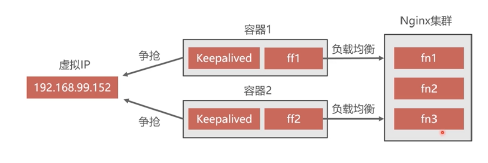

# 前端Docker部署


## 一、创建并运行Nginx容器

```shell
docker run -it -d -name fn1 -v /home/fn1/nginx.conf:/etc/nginx/nginx.conf -v /home/fn1/renren-vue:/home/fn1/renren-vue --privileged --net=host nginx
```


## 二、利用Keepalived实现双机热备



