# 函数

## 一、定义

给定一个数集A，对A施加一个对应的法则/映射f，记做:f(A)，那么 可以得到另外一个数集B，也就是可以认为B=f(A);那么这个关系 就叫做函数关系式，简称函数。三个重要的因素: 定义域A、值域B、 对应的映射法则f。 

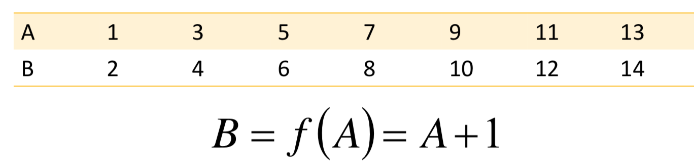

## 二、常见函数

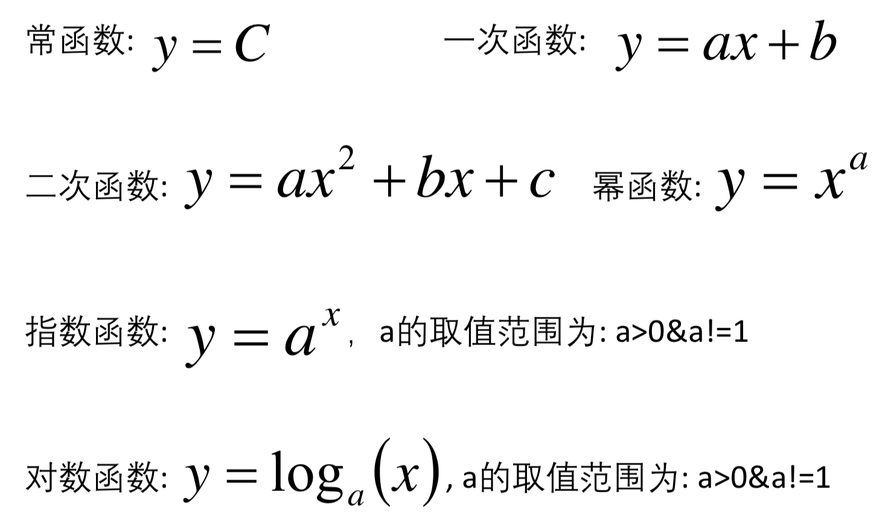

## 三、反函数

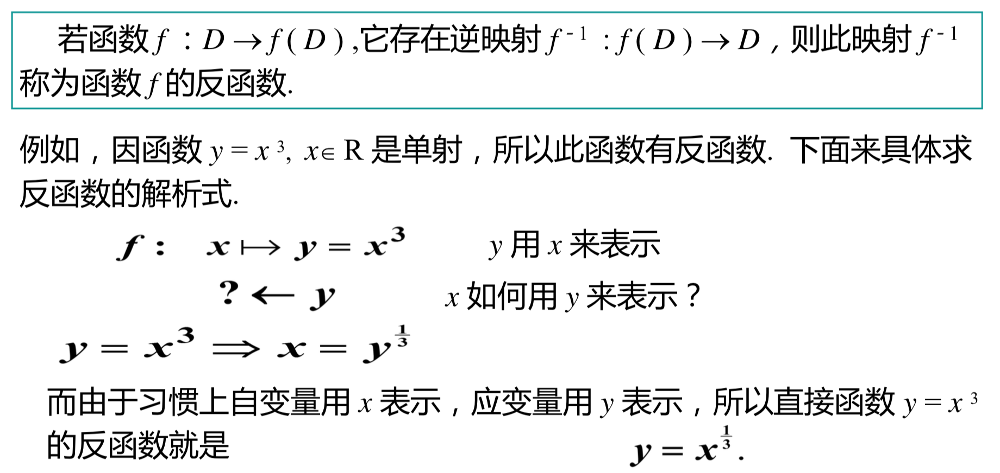

## 四、反函数的性质 

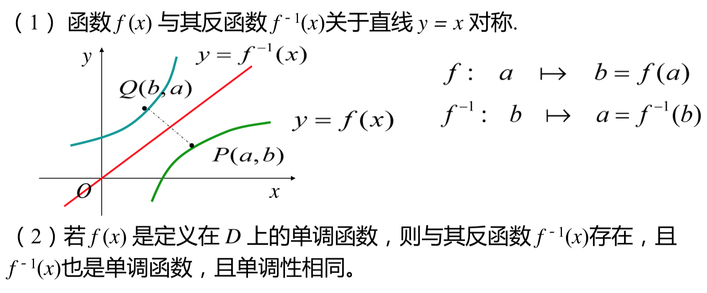

## 五、复合函数 

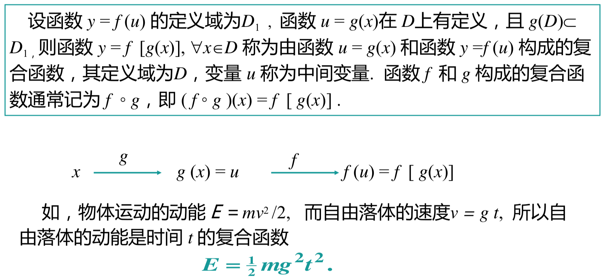

## 六、基本初等函数 (Basic Elementary Functions) 

## 6.1 幂函数(Power Function) 

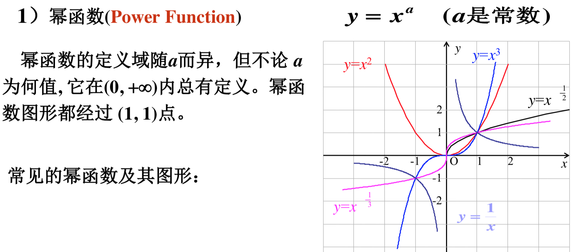

## 6.2 指数函数 (Exponential Function) 

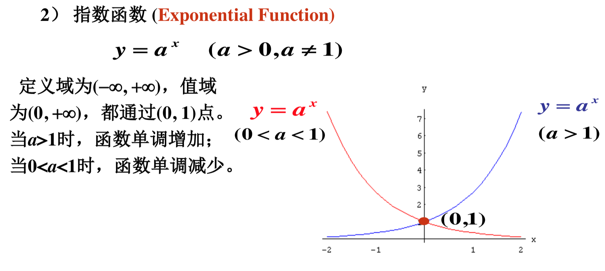

## 6.3 对数函数 (Logarithmic Function) 

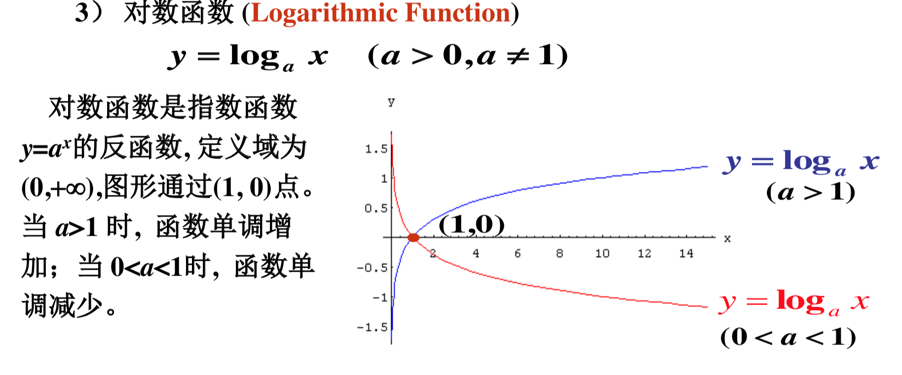

## 6.4 三角函数 (Trigonometric Function)  

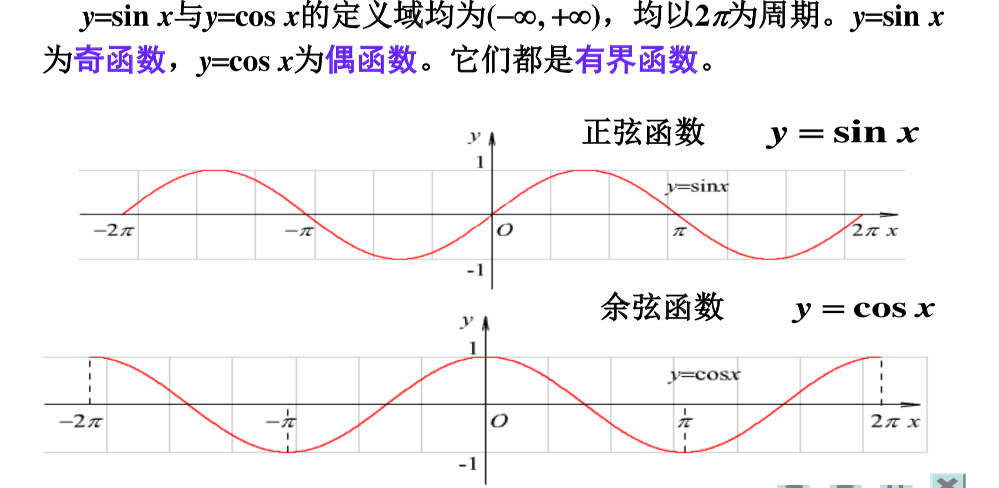

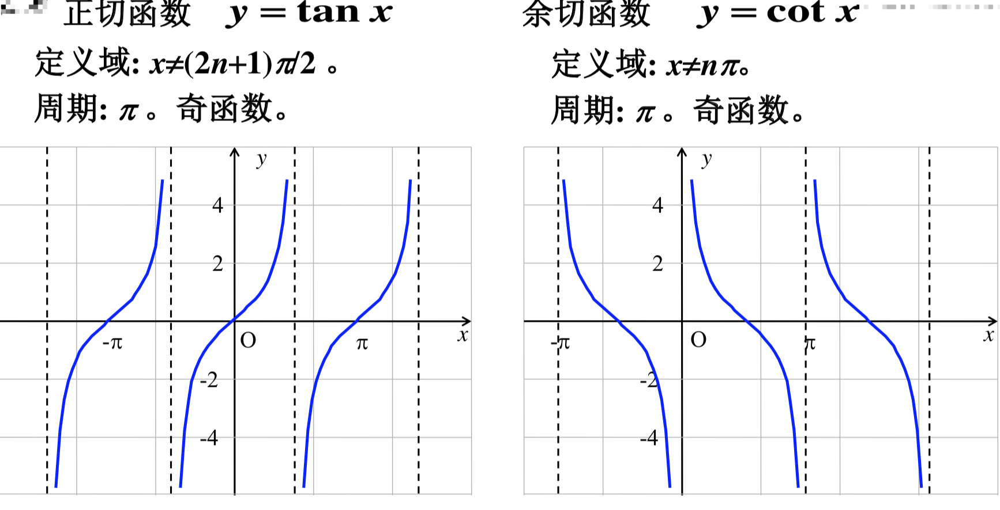

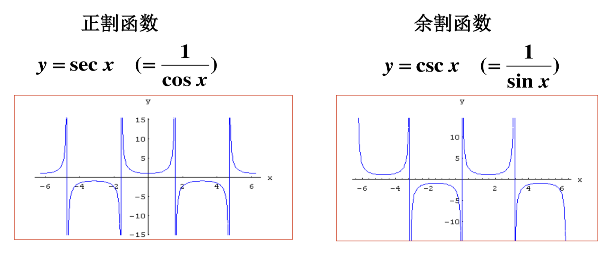

## 6.5 反三角函数(Anti-Trigonometric Function) 

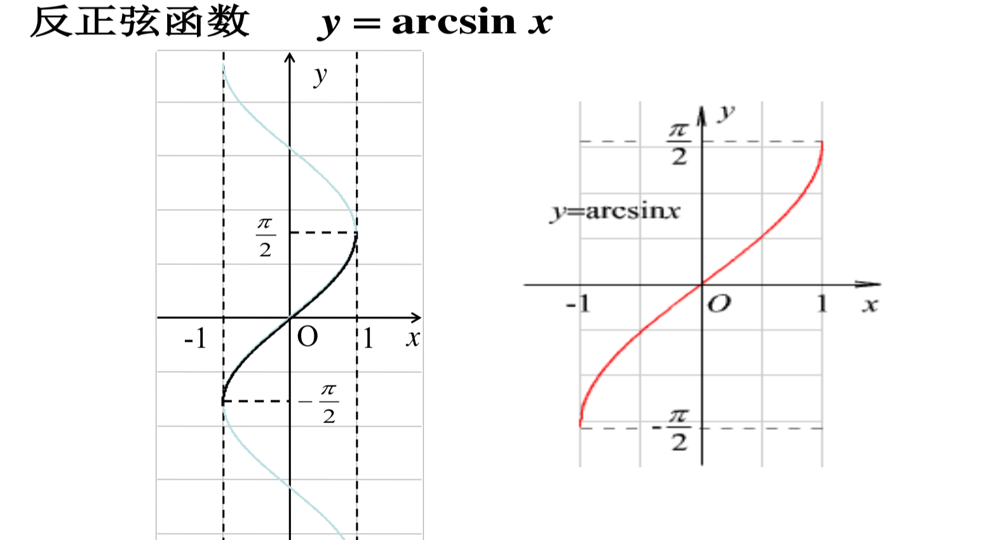

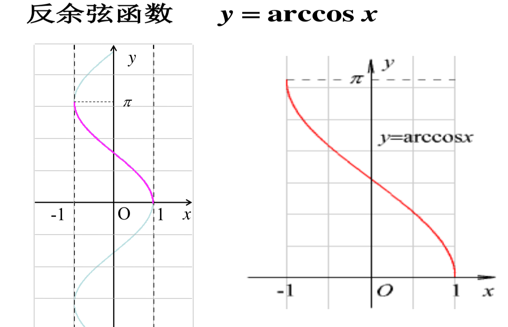

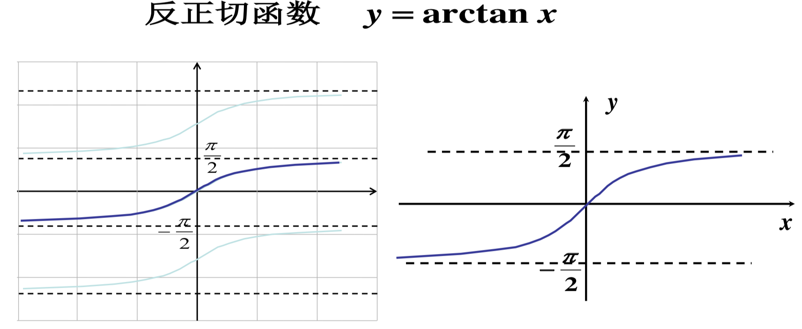

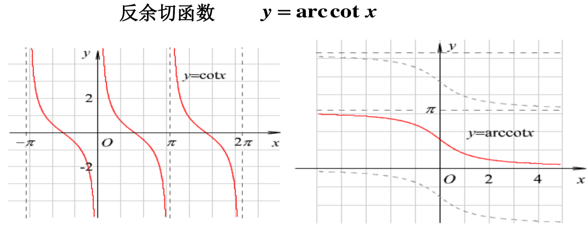

