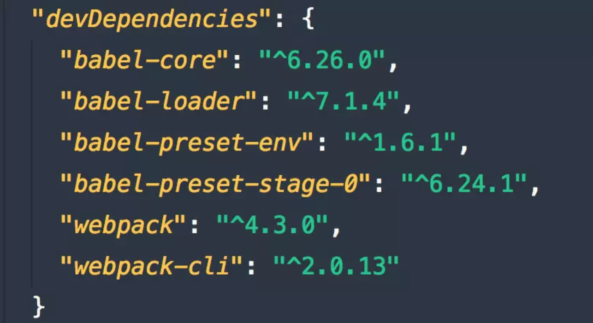
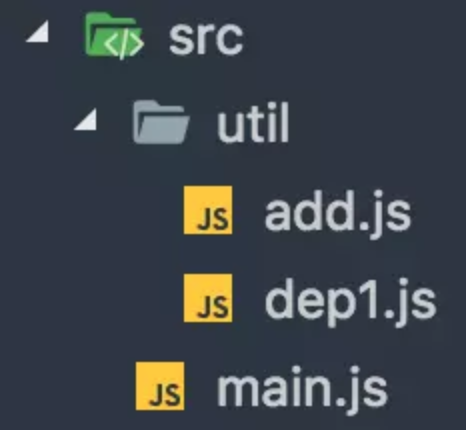
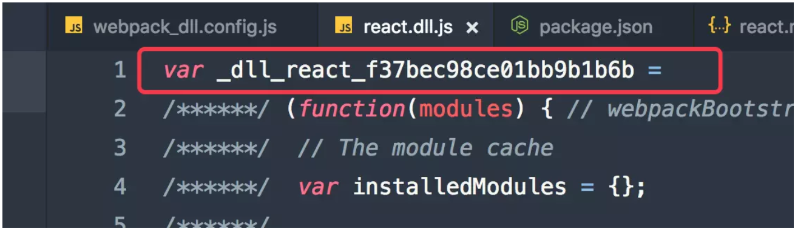
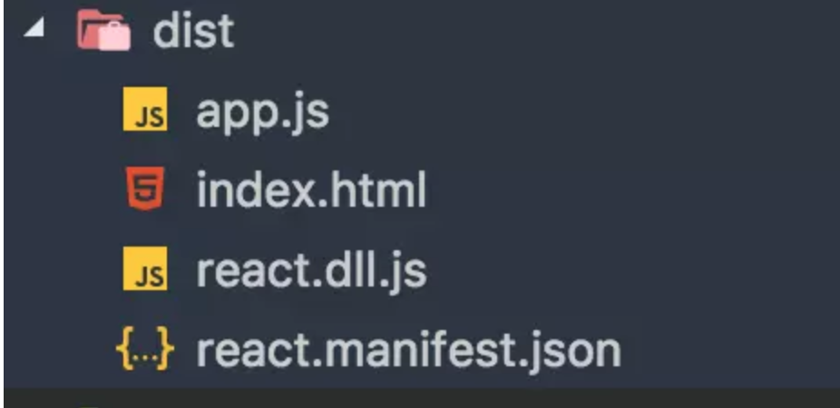
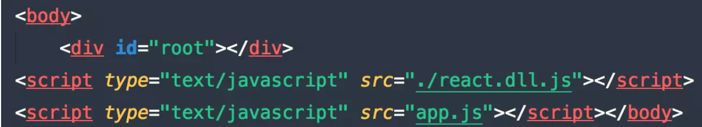

# webpack4.0打包优化策略(一)

## webpack4.0新特性

[webpack4.0 新特性介绍](https://link.juejin.im/?target=http%3A%2F%2Fju.outofmemory.cn%2Fentry%2F343762)

## 当前依赖包的版本




## 1.优化loader配置


### 1.1 缩小文件匹配范围(include/exclude)

> 通过排除node_modules下的文件 从而缩小了loader加载搜索范围 高概率命中文件

```js
module: {
  rules: [
    {
      test: /\.js$/,
      use: 'babel-loader',
      exclude: /node_modules/, // 排除不处理的目录
      include: path.resolve(__dirname, 'src') // 精确指定要处理的目录
    }
  ]
}
```


### 1.2 缓存loader的执行结果(cacheDirectory)

> cacheDirectory是loader的一个特定的选项，默认值是false。指定的目录(use: 'babel-loader?cacheDirectory=cacheLoader')将用来缓存loader的执行结果，减少webpack构建时Babel重新编译过程。如果设置一个空值(use: 'babel-loader?cacheDirectory') 或true(use: 'babel-loader?cacheDirectory=true') 将使用默认的缓存目录(node_modules/.cache/babel-loader)，如果在任何根目录下都没有找到 node_modules 目录，将会降级回退到操作系统默认的临时文件目录。

```js
module: {
  rules: [
    {
      test: /\.js$/,
      use: 'babel-loader?cacheDirectory', // 缓存loader执行结果 发现打包速度已经明显提升了
      exclude: /node_modules/,
      include: path.resolve(__dirname, 'src')
    }
  ]
}
```


## 2.resolve优化配置


### 2.1 优化模块查找路径 resolve.modules

> Webpack的resolve.modules配置模块库（即 node_modules）所在的位置，在 js 里出现  import 'vue' 这样不是相对、也不是绝对路径的写法时，会去 node_modules 目录下找。但是默认的配置，会采用向上递归搜索的方式去寻找，但通常项目目录里只有一个 node_modules，且是在项目根目录，为了减少搜索范围，可以直接写明 node_modules 的全路径；同样，对于别名(alias)的配置，亦当如此：



```js
const path = require('path');

function resolve(dir) { // 转换为绝对路径
  return path.join(__dirname, dir);
}

resolve: {
  modules: [ // 优化模块查找路径
    path.resolve('src'),
    path.resolve('node_modules') // 指定node_modules所在位置 当你import 第三方模块时 直接从这个路径下搜索寻找
  ]
}
```

配置好src目录所在位置后，由于util目录是在src里面 所以可以用下面方式引入util中的工具函数

```js
// main.js

import dep1 from 'util/dep1';
import add from 'util/add';
```


### 2.2 resolve.alias 配置路径别名

> 创建 import 或 require 的路径别名，来确保模块引入变得更简单。配置项通过别名来把原导入路径映射成一个新的导入路径 此优化方法会影响使用Tree-Shaking去除无效代码

例如，一些位于 src/ 文件夹下的常用模块：

```js
alias: {
  Utilities: path.resolve(__dirname, 'src/utilities/'),
  Templates: path.resolve(__dirname, 'src/templates/')
}
```

现在，替换「在导入时使用相对路径」这种方式，就像这样：

```js
import Utility from '../../utilities/utility';
```

你可以这样使用别名：

```js
import Utility from 'Utilities/utility';
resolve: {
  alias: { // 别名配置 通过别名配置 可以让我们引用变的简单
    'vue$': 'vue/dist/vue.common.js', // $表示精确匹配
      src: resolve('src') // 当你在任何需要导入src下面的文件时可以 import moduleA from 'src/moduleA' src会被替换为resolve('src') 返回的绝对路径 而不需要相对路径形式导入
  }
}
```

也可以在给定对象的键后的末尾添加 $，以表示精准匹配：

```js
alias: {
  util$: resolve('src/util/add.js')
}
```

这将产生以下结果：

```js
import Test1 from 'util'; // 精确匹配，所以 src/util/add.js 被解析和导入
import Test2 from 'util/dep1.js'; // 精确匹配，触发普通解析 util/dep1.js
```

### 2.3 resolve.extensions

> 当引入模块时不带文件后缀 webpack会根据此配置自动解析确定的文件后缀

- 后缀列表尽可能小
- 频率最高的往前放
- 导出语句尽可能带上后缀

```js
resolve: {
  extensions: ['.js', '.vue']
}
```


## 3.module.noParse

> 用了noParse的模块将不会被loaders解析，所以当我们使用的库如果太大，并且其中不包含import require、define的调用，我们就可以使用这项配置来提升性能, 让 Webpack 忽略对部分没采用模块化的文件的递归解析处理。

```js
// 忽略对jquery lodash的进行递归解析
module: {
  // noParse: /jquery|lodash/

  // 从 webpack 3.0.0 开始
  noParse: function(content) {
    return /jquery|lodash/.test(content)
  }
}
```


## 4.HappyPack

> HappyPack是让webpack对loader的执行过程，从单一进程形式扩展为多进程模式，也就是将任务分解给多个子进程去并发的执行，子进程处理完后再把结果发送给主进程。从而加速代码构建 与 DLL动态链接库结合来使用更佳。

```shell
npm i happypack@next -D
```

webpack.config.js

```js
const HappyPack = require('happypack');
const os = require('os'); // node 提供的系统操作模块

// 根据我的系统的内核数量 指定线程池个数 也可以其他数量
const happyThreadPool = HappyPack.ThreadPool({size: os.cpus().lenght})

module: {
  rules: [
    {
      test: /\.js$/,
      use: 'happypack/loader?id=babel',
      exclude: /node_modules/,
      include: path.resolve(__dirname, 'src')
    }
  ]
},
  plugins: [
    new HappyPack({ // 基础参数设置
      id: 'babel', // 上面loader?后面指定的id
      loaders: ['babel-loader?cacheDirectory'], // 实际匹配处理的loader
      threadPool: happyThreadPool,
      // cache: true // 已被弃用
      verbose: true
    });
  ]
```

happypack提供的loader，是对文件实际匹配的处理loader。这里happypack提供的loader与plugin的衔接匹配，则是通过id=happypack来完成。 资料:[happypack原理解析-淘宝前端](https://link.juejin.im?target=http%3A%2F%2Ftaobaofed.org%2Fblog%2F2016%2F12%2F08%2Fhappypack-source-code-analysis%2F)

```shell
npm run dev
```


## 5.DLL动态链接库

> 在一个动态链接库中可以包含其他模块调用的函数和数据，动态链接库只需被编译一次，在之后的构建过程中被动态链接库包含的模块将不会被重新编译,而是直接使用动态链接库中的代码。

- 将web应用依赖的基础模块抽离出来，打包到单独的动态链接库中。一个链接库可以包含多个模块。
- 当需要导入的模块存在于动态链接库，模块不会再次打包，而是去动态链接库中去获取。
- 页面依赖的所有动态链接库都需要被加载。

5.1 定义DLL配置

> 依赖的两个内置插件：**DllPlugin** 和 **DllReferencePlugin**

5.1.1 创建一个DLL配置文件webpack_dll.config.js

```js
module.exports = {
  entry: {
    react: ['react', 'react-dom']
  },
  output: {
    filename: '[name].dll.js', // 动态链接库输出的文件名称
    path: path.join(__dirname, 'dist'), // 动态链接库输出路径
    libraryTarget: 'var', // 链接库(react.dll.js)输出方式 默认'var'形式赋给变量 b
    library: '_dll_[name]_[hash]' // 全局变量名称 导出库将被以var的形式赋给这个全局变量 通过这个变量获取到里面模块
  },
  plugins: [
    new webpack.DllPlugin({
      // path 指定manifest文件的输出路径
      path: path.join(__dirname, 'dist', '[name].manifest.json'),
      name: '_dll_[name]_[hash]', // 和library 一致，输出的manifest.json中的name值
    })
  ]
}
```

5.1.2 output.libraryTarget 规定了以哪一种导出你的库  默认以全局变量形式 浏览器支持的形式



具体包括如下：

- "var" - 以直接变量输出(默认library方式) var Library = xxx (default)
- "this" - 通过设置this的属性输出 this["Library"] = xxx
- "commonjs" - 通过设置exports的属性输出 exports["Library"] = xxx
- "commonjs2" - 通过设置module.exports的属性输出 module.exports = xxx
- "amd" - 以amd方式输出
- "umd" - 结合commonjs2/amd/root

5.1.3 打包生成动态链接库

```
webpack --config webpack_dll.config.js --mode production
```



在dist目录下 多出react.dll.js 和 react.manifest.json

- react.dll.js 动态链接库 里面包含了 react和react-dom的内容
- react.manifest.json 描述链接库(react.dll)中的信息

5.2 在主配置文件中使用动态链接库文件

```js
// webpack.config.js

const webpack = require('webpack');

plugins: [
  // 当我们需要使用动态链接库时 首先会找到manifest文件 得到name值记录的全局变量名称 然后找到动态链接库文件 进行加载
  new webpack.DllReferencePlugin({
    manifest: require('./dist/react.manifest.json')
  })
]
```

5.3 将动态链接库文件加载到页面中

需要借助两个webpack插件

- html-webpack-plugin 产出html文件
- html-webpack-include-assets-plugin 将js css资源添加到html中 扩展html插件的功能

```shell
npm i html-webpack-plugin html-webpack-include-assets-plugin -D
```

配置webpack.config.js

```js
const webpack = require('webpack');
const HtmlWebpackPlugin = require('html-webpack-plugin');
const HtmlIncludeAssetsPlugin = require('html-webpack-include-assets-plugin');

pluings: [
  new webpack.DllReferencePlugin({
    manifest: require('./dist/react.manifest.json')
  }),
  new HtmlWebpackPlugin({
    template: path.join(__dirname, 'src/index.html')
  }),
  new HtmlIncludeAssetsPlugin({
    assets: ['./react.dll.js'], // 添加的资源相对html的路径
    append: false // false 在其他资源的之前添加 true 在其他资源之后添加
  });
]
```

此时react.dll.js和main.js被自动引入到页面中，并且dll文件在main.js之前加载




## 6.ParallelUglifyPlugin

> 这个插件可以帮助有很多入口点的项目加快构建速度。把对JS文件的串行压缩变为开启多个子进程并行进行uglify。

```js
cnpm i webpack-parallel-uglify-plugin -D
// webpck.config.js

const ParallelUglifyPlugin = require('webpack-parallel-uglify-plugin');

plugins: [
  new ParallelUglifyPlugin({
    workerCount: 4,
    uglifyJS: {
      output: {
        beautify: false, // 不需要格式化
        comments: false // 保留注释
      },
      compress: { // 压缩
        warnings: false, // 删除无用代码时不输出警告
        drop_console: true, // 删除console语句
        collapse_vars: true, // 内嵌定义了但是只有用到一次的变量
        reduce_vars: true // 提取出出现多次但是没有定义成变量去引用的静态值
      }
    }
  });
]
```

执行压缩

```js
webpack --mode production
```

## 7.Tree Shaking

> 剔除JavaScript中用不上的代码。它依赖静态的ES6模块化语法，例如通过impot和export导入导出

### commonJS模块 与 es6模块的区别

commonJS模块：

- 1.动态加载模块 commonJS 是运行时加载 能够轻松实现懒加载，优化用户体验
- 2.加载整个模块 commonJS模块中，导出的是整个模块
- 3.每个模块皆为对象 commonJS模块被视作一个对象
- 4.值拷贝 commonJS的模块输出和函数的值传递相似，都是值得拷贝

es6模块

- 1.静态解析 es6模块时 编译时加载 即在解析阶段就确定输出的模块的依赖关系，所以es6模块的import一般写在被引入文件的开头
- 2.模块不是对象 在es6里，每个模块并不会当做一个对象看待
- 3.加载的不是整个模块 在es6模块中 一个模块中有好几个export导出
- 4.模块的引用 es6模块中，导出的并不是模块的值得拷贝，而是这个模块的引用

7.1 保留ES6模块化语法

```js
// .babelrc

{
  "presets": [
    [
      "env", {
        modules: false // 不要编译ES6模块
      },
      "react",
      "stage-0"
    ]
  ]
}
```

7.2 执行生产编译 默认已开启Tree Shaking

```js
webpack --mode production
```

### 什么是Tree Shaking?

有个funs.js 里面有两个函数

```js
// funs.js
export const sub = () => 'hello webpack!';
export const mul = () => 'hello shaking!';
```

main.js 中依赖funs.js

```js
// main.js
import {sub} from './funs.js'

sub();
```

在main.js只使用了里面的 sub函数 默认情况下也会将funs.js里面其他没有的函数也打包进来, 如果开启tree shaking 生产编译时

```js
webpack --mode production  //此时funs.js中没有被用到的代码并没打包进来 而被剔除出去了
```


