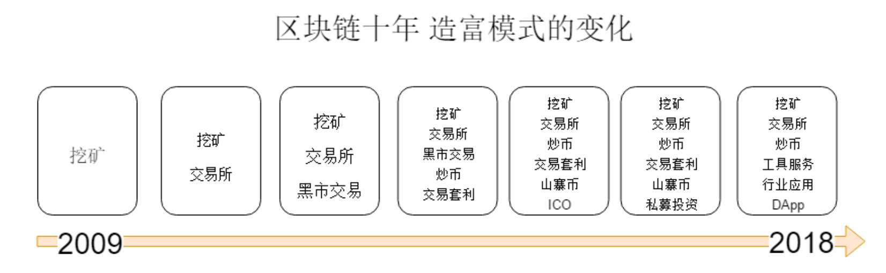
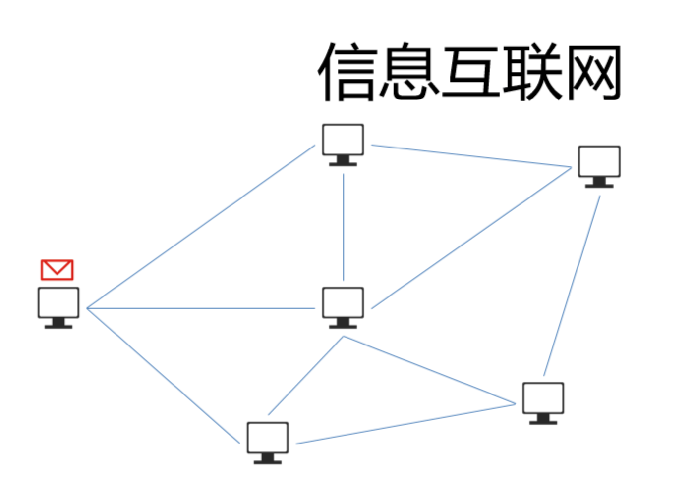
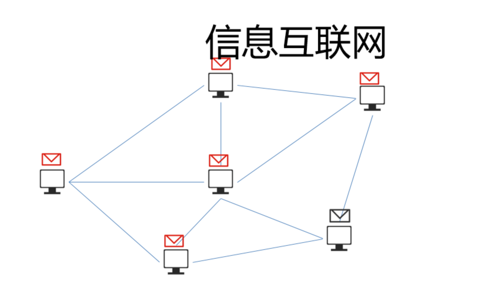
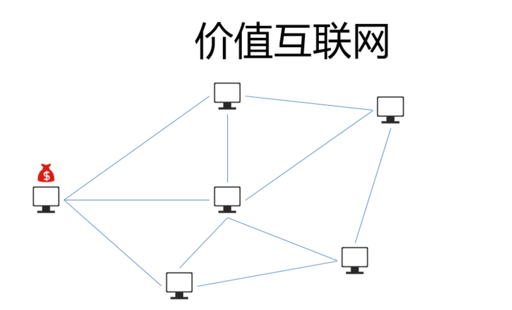
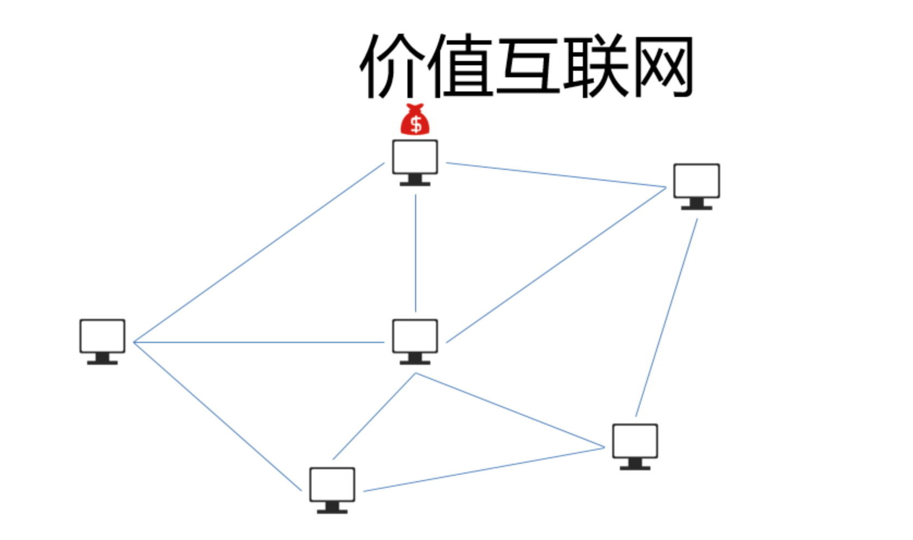
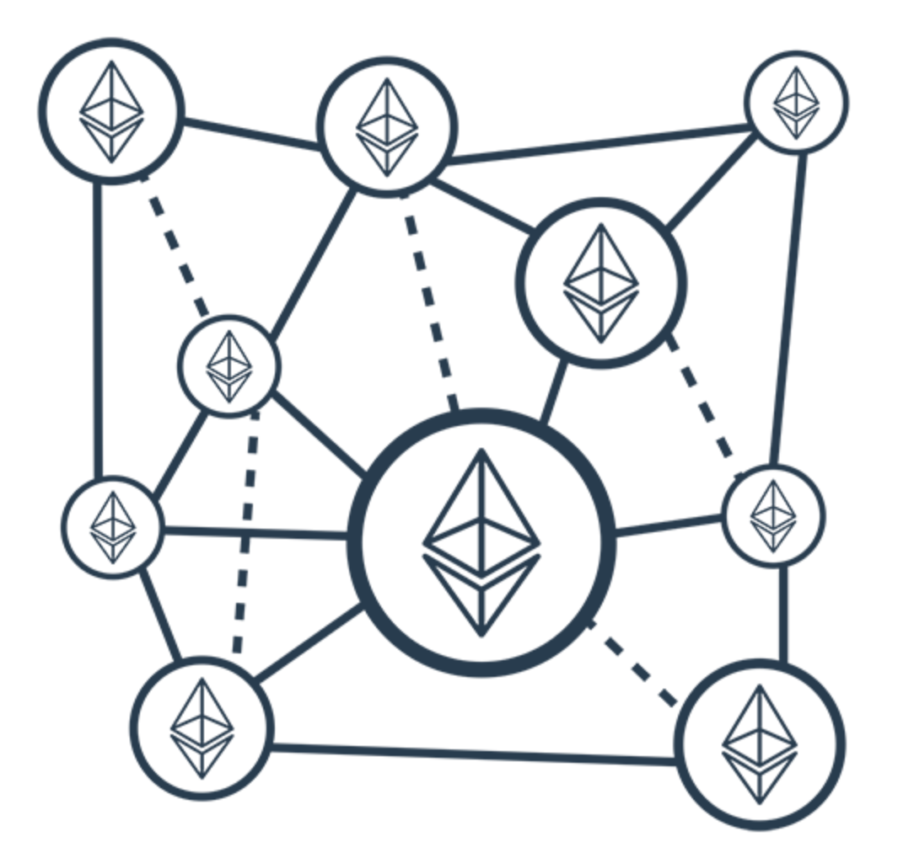
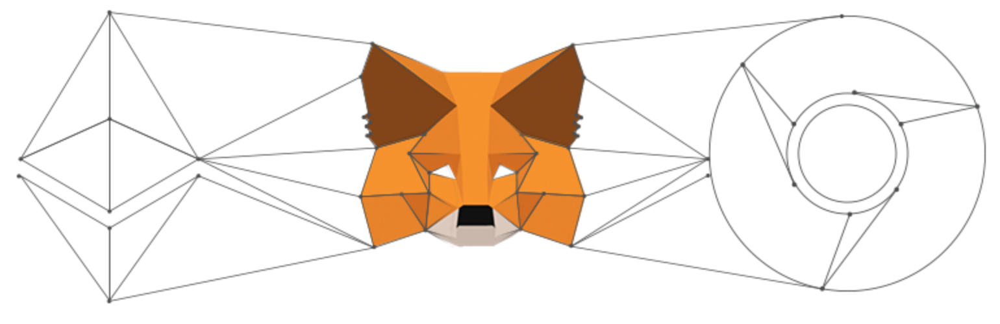
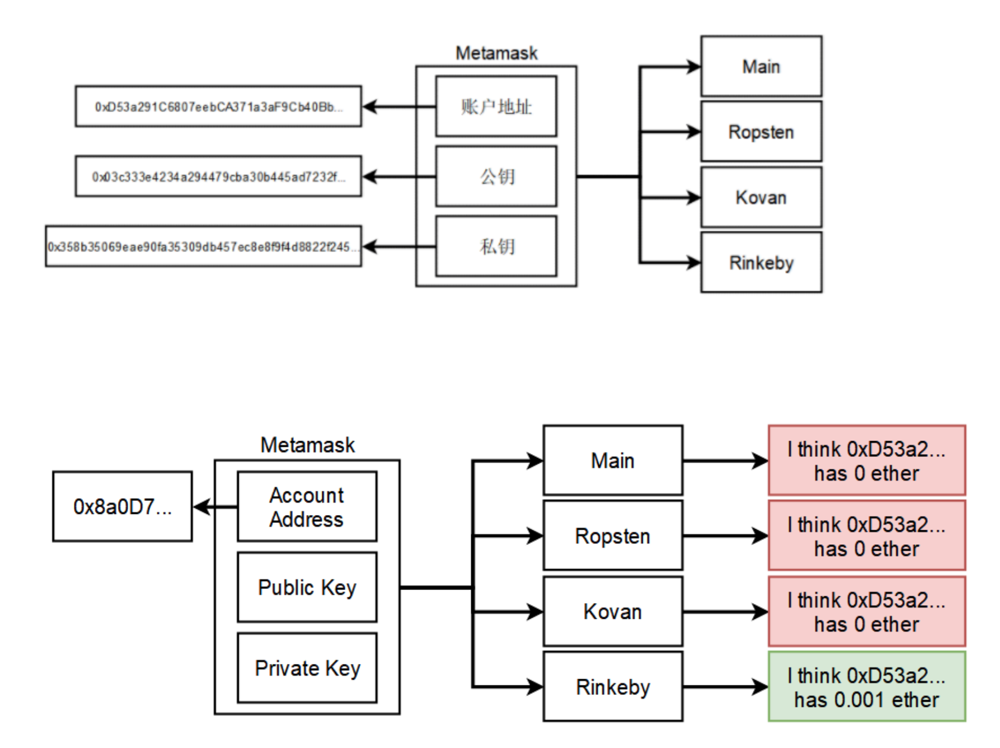

## 一、区块链的十年 




## 二、为什么要学习Dapp开发

收益高，门槛低，空间大，工具全，不违规


## 三、2018年区块链市场分析

挖矿:算力猛增,门槛越来越高,依赖于人工智能挖矿

炒币:二级市场赚钱难度迅速提升,是割韭菜还是被割?

交易所: 数量急剧膨胀, 国内不合法, 政策风险大

ICO: 国内不合法,转型私募,投资逻辑变化,回归理性投资

工具服务: 机会多,门槛高, 辛苦钱

DApp: 巨大蓝海,机会无限,需要理解区块链,经济系统,用户痛点,具备产品能力.


## 四、从信息互联网到价值互联网










## 五、区块链机会，财务自由

1. 野火 0xb1ed364e4333aae1da4a901d5231244ba6a35f9421d4607f7cb90d60bf45578a

2. 资产转移

3. 无国界贸易,抗击自裁

4. 募集资金

5. 博彩

6. 避税

7. 流量收割


## 六、什么是以太坊 



1. 以太坊是一个区块链的网络, 由很多节点组成
2. 以太坊可以转账,可以做数据存储
3. 以太坊网络有很多个, 主网只有一个. 还有很多测试网络, 我们也可以自己搭建私链
4. 以太坊和比特币一样 有很多的node节点组成
5. 一个node节点其实就是一个运行以太坊客户端的计算机
6. 以太坊还是公有链, 每个人都可以加入以太坊网络
7. 每一个以太坊节点都可以同步全部的账本/区块链信息(blockchain)
8. 可以理解以太坊是一个数据库,存储了所有的转账信息(transaction信息)


## 七、如何和以太坊网络交互

1. 开发者 web3.js
2. 一般用户 metamask(稳定,适合开发测试,也适合小白用户) mist浏览器 (很多bug,早期版本)


metamask 官网: <https://metamask.io/>

mist 官网 : <https://github.com/ethereum/mist/releases>


## 八、如何安装metamask  



1. 安装chrome浏览器. 推荐使用chrome

2. chrome商店 metamask

3. 添加安装

4. 用户协议

5. 用户密码 12345678

6. 种子单词 crouch fiction income edge cluster turtle plastic ozone mom predict goddess express

7. 几个网络介绍(主网,测试网络,几个测试网络的区别)


## 九、以太坊的测试网络

以太坊可以搭建私有的测试网络，不过由于以太坊是一个去中心化的平台，需要较多节点共同运作才能得到理想的测试效果，因此并不推荐自行搭建测试网络。

以太坊公开的测试网络共有4个，目前仍在运行的有3个。每个网络都有自己的创世区块和名字，按开始运行时间的早晚，依次为：

- Morden(已退役)

Morden是以太坊官方提供的测试网络 . 2016年11月时，由于难度炸弹已经严重影响出块速度，不得不退役，Morden的共识机制为PoW。

- Ropsten

Ropsten也是以太坊官方提供的测试网络，是为了解决Morden难度炸弹问题而重新启动的一条区块链，目前仍在运行，共识机制为PoW。测试网络上的以太币并无实际价值，因此Ropsten的挖矿难度很低，目前在755M左右，仅仅只有主网络的0.07%。这样低的难度一方面使一台普通笔记本电脑的CPU也可以挖出区块，获得测试网络上的以太币，方便开发人员测试软件，但是却不能阻止攻击。

PoW共识机制要求有足够强大的算力保证没有人可以随意生成区块，这种共识机制只有在具有实际价值的主网络中才会有效。测试网络上的以太币没有价值，也就不会有强大的算力投入来维护测试网络的安全，这就导致了测试网络的挖矿难度很低，即使几块普通的显卡，也足以进行一次51%攻击，或者用垃圾交易阻塞区块链，攻击的成本及其低廉。

2017年2月，Ropsten便遭到了一次利用测试网络的低难度进行的攻击，攻击者发送了千万级的垃圾交易，并逐渐把区块Gas上限从正常的4,700,000提高到了90,000,000,000，在一段时间内，影响了测试网络的运行。攻击者发动这些攻击，并不能获得利益，仅仅是为了测试、炫耀、或者单纯觉得好玩儿。

- Kovan

为了解决测试网络中PoW共识机制的问题，以太坊钱包Parity的开发团队发起了一个新的测试网络Kovan。Kovan使用了权威证明(Proof-of-Authority)的共识机制，简称PoA。

PoW是用工作量来获得生成区块的权利，必须完成一定次数的计算后，发现一个满足条件的谜题答案，才能够生成有效的区块。

PoA是由若干个权威节点来生成区块，其他节点无权生成，这样也就不再需要挖矿。由于测试网络上的以太币无价值，权威节点仅仅是用来防止区块被随意生成，造成测试网络拥堵，完全是义务劳动，不存在作恶的动机，因此这种机制在测试网络上是可行的。

Kovan与主网络使用不同的共识机制，影响的仅仅是谁有权来生成区块，以及验证区块是否有效的方式，权威节点可以根据开发人员的申请生成以太币，并不影响开发者测试智能合约和其他功能。

Kovan目前仍在运行，但仅有Parity钱包客户端可以使用这个测试网络。

- Rinkeby

Rinkeby也是以太坊官方提供的测试网络，使用PoA共识机制。我们采用rinkeby网络


# 十、区块链原理回顾

<https://anders.com/blockchain/>

1. translation 交易

2. hash校验

3. 工作量证明 pow

4. block成链

5. 私钥转账签名

6. web接口

7. websocket分布式


## 十一、以太坊的账户系统

公钥,私钥,地址长度.

私钥 <==> 公钥

公钥 ==> 地址(短)

账户的注册(qq邮箱,163邮箱,讲解密码的存储)

解释为什么一个账户,全网可用.



## 十二、账户系统创建的特点

- 不需要网络

- 不需要服务商

- 只是一组publickey和privatekey

- Address由publickey生成


## 十三、演示一下如何接收一点以太币

```
几个以太坊的水龙头
http://rinkeby-faucet.com
http://www.itheima.com/tools/fancet/
```


