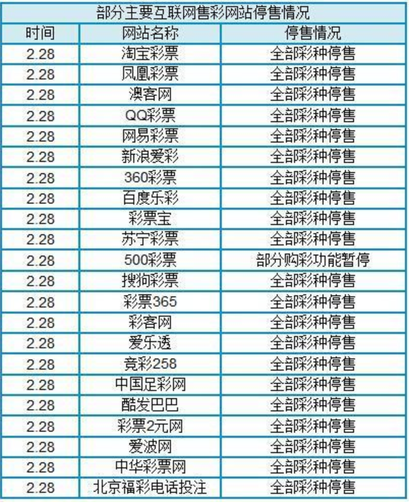
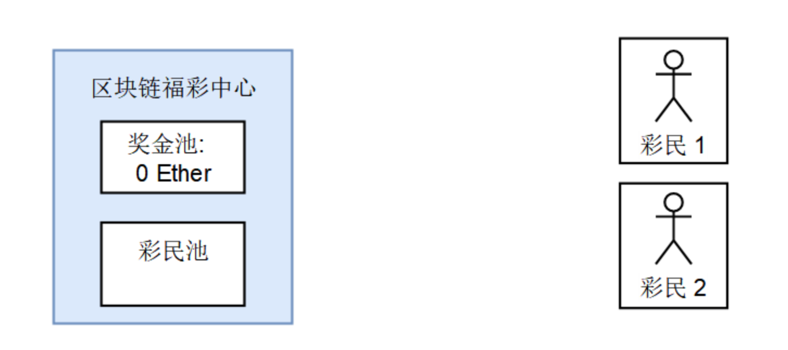
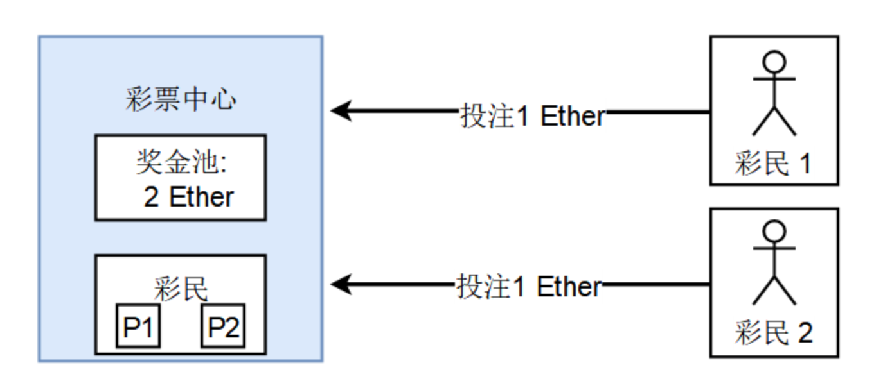
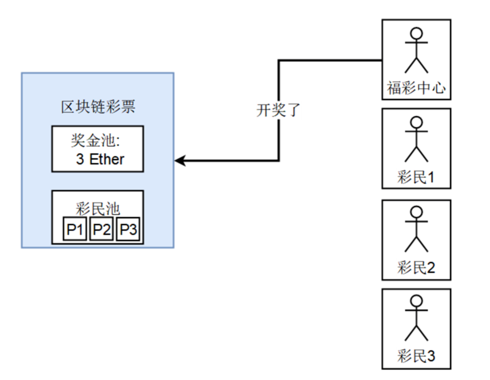
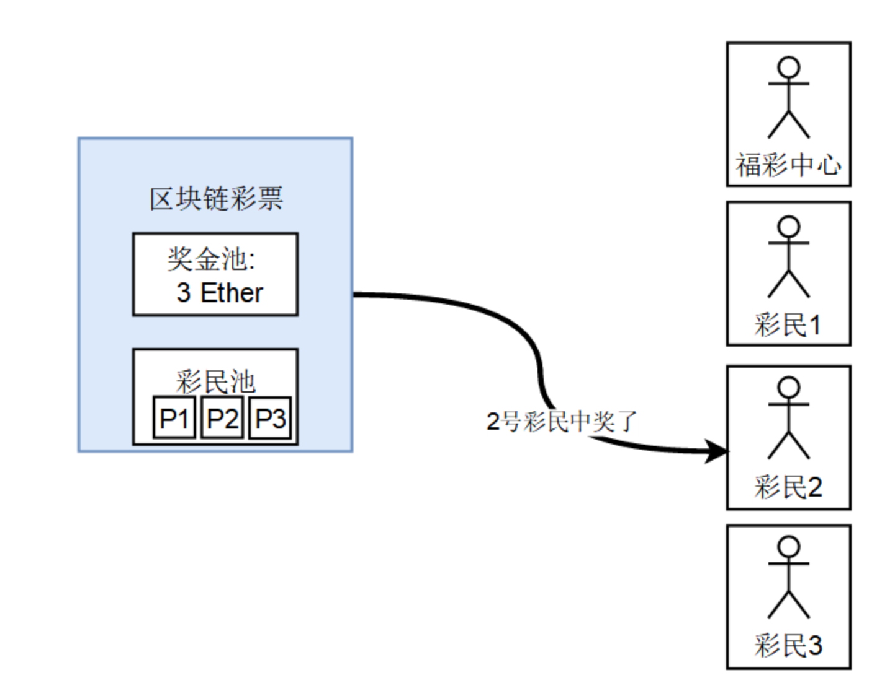
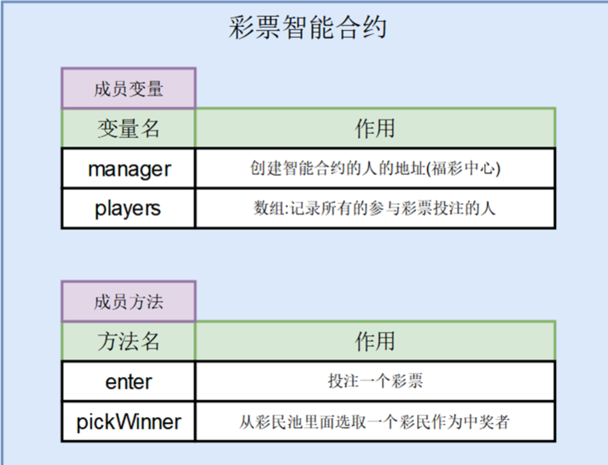
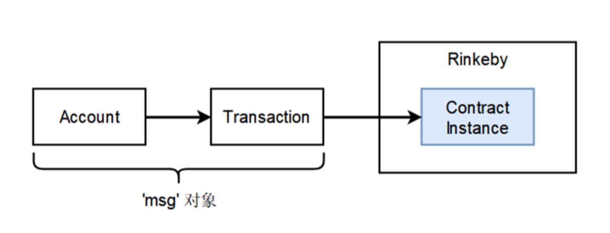
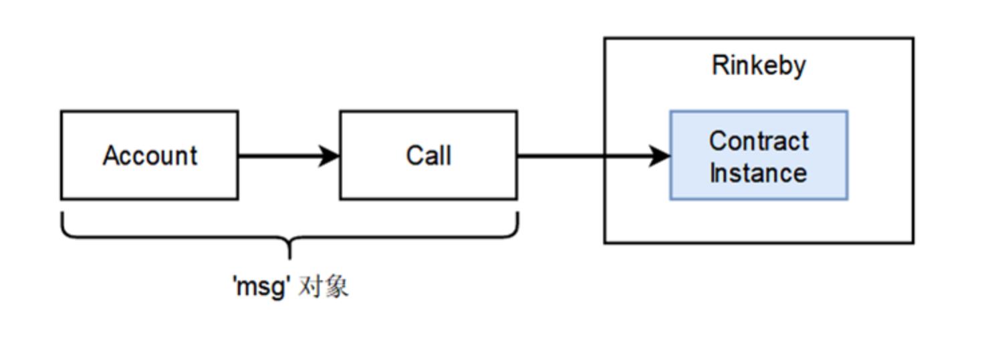

## 业务分析 

区块链技术可以解决传统彩票项目的哪些痛点? 发行彩票,筹集资金,帮助有困难的人民 《国务院关于进一步规范彩票管理的通知》（国发[2001]35号）规定，返奖比例不得低于50％，发行管理费用比例不得高于15％，彩票公益金比例不得低于35％。 福利彩票30年累计发行销售15781亿多元，筹集公益金4757亿多元。管理费2367亿元。 


## 传统互联网彩票业务的痛点

 互联网彩票业务在2015年遭遇到了挫折，国家体育总局发布《体育总局关于切实落实彩票资金专项审计意见加强体育彩票管理工作的通知》，通知提出，要深入开展自查自纠，依法进行整改，彻底清理整治违规利用互联网销售彩票等问题。

此后财政部、民政部和国家体育总局三部委“三管齐下”要求互联网彩票停售整改。

此后，原本一片红火的互联网彩票业务，纷纷下线。互联网销售彩票被叫停，被世界杯带热的互联网彩票，在这一年重新归零。大的互联网售彩平台比如淘宝、腾讯、网易、500万网、澳客网等等相继宣布停止售彩。 



其次是互联网彩票层层授权的营销模式，增加了管理的层级和数据风险。包括数据安全存风险、销售数据、彩民与网站信息不对称等。

另一方面也源于互联网打破了地域限制的特点使得原本有着地域属性的彩票的利益分成出现了麻烦。

因为彩票销售收入的部分分成归于地方财政，且部分高频彩等地方彩种对销售地的限制，比如有业内人士谈到，A省的彩票资金，线下销售点只能卖到当地。但借助互联网后能卖到全国，这可能导致资金被抽到B省，就相当于把属于其他省的公益金夺走，这和“串货”的逻辑是一样的。

互联网彩票动了原有利益结构，这才是监管痛下杀手的根本原因。


## 彩票的信任危机 


技术角度探讨交流,切勿用于非法用途. 根据《中华人民共和国刑法》第三百零三规定，赌博罪，是指以营利为目的，聚众赌博或者以赌博为业的行为。 《最高人民法院最高人民检察院关于办理赌博刑事案件具体应用法律若干问题的解释》的相关规定：以营利为目的，有下列情形之一的，属于刑法第三百零三条规定的“聚众赌博”：

（一）组织3人以上赌博，抽头渔利数额累计达到5000元以上的；

（二）组织3人以上赌博，赌资数额累计达到5万元以上的；

（三）组织3人以上赌博，参赌人数累计达到20人以上的；

（四）组织中华人民共和国公民10人以上赴境外赌博，从中收取回扣、介绍费的。


以营利为目的，在计算机网络上建立赌博网站，或者为赌博网站担任代理，接受投注的，也属于刑法规定的“开设赌场”的行为。所以大家以后再要想玩玩牌的话，前往不要把赌资抬的太高，也不要随便拉拢或怂恿他人去赌博，这样很可能就把自己搞进去了。


## 智能合约区块链的方式 区块链彩票









player1 player2 购买彩票

钱放入奖金池,

manager负责让区块链智能合约开奖(注意是智能合约开奖, 不是manager开奖)


## 掌握的技能

- 如何处理ether
- 常见solidity的数据结构

\#区块链彩票项目 智能合约设计

- 字段

1. manager
2. player

- 函数

1. manger的开奖函数 pickWinner()
2. player的投注函数 enter()




## solidity基本数据类型

| 类型          | 说明     | 示例                                       |
| ------------- | -------- | ------------------------------------------ |
| string        | 字符串   | "hi"                                       |
| bool          | 布尔     | true false                                 |
| int           | 整型     | 300 , 0 , -200                             |
| uint          | 非负整数 | 30                                         |
| fixed/unfixed | 小数     | 3.14 -3.14                                 |
| address       | 地址     | 0xD53a291C6807eebCA371a3aF9Cb40Bb7556B7DC4 |

int8 int16 int32 ... int256/int

uint8 uint16 uint32 ... uint256 / uint


## 彩票智能合约初步

声明智能合约的成员变量

address public manager , manager存储的就是部署这个智能合约的人的地址

在构造函数中初始化 manager

如何在初始化的时候 就把manager的地址设置好呢?

### msg 全局变量

msg 全称 message 描述了transaction和call的所有细节信息. 换句话说就是函数调用过程中的所有信息. 





| 属性名称   | 属性作用                      |
| ---------- | ----------------------------- |
| msg.data   | transaction或call的data的信息 |
| msg.gas    | transaction的调用花了多少gas  |
| msg.sender | 调用者的address               |
| msg.value  | 调用者花了多少钱 (ether)      |

构造函数中完成地址的赋值

```js
function Lottery() public{
    manager = msg.sender;
}
```


### solidity 数组入门

| 名称     | 说明             | 示例           |
| -------- | ---------------- | -------------- |
| 定长数组 | 数组长度固定     | int[3] bool[2] |
| 动态数组 | 数组长度动态调整 | int[] bool[]   |

```
uint[] public myArray;
myArray.push(1);
myArray.push(30);
myArray.push(20);
myArray.length;
myArray[0];
```

测试一下solidity自动为public生成的函数

<https://solidity.readthedocs.io/en/v0.4.24/types.html>


### solidity的map和结构体

| 名称     | 说明                 | 示例                                       |
| -------- | -------------------- | ------------------------------------------ |
| 定长数组 | 数组长度固定         | int[3] bool[2]                             |
| 动态数组 | 数组长度动态调整     | int[] bool[]                               |
| mapping  | 键值对 类似java的map | mapping(string=>string) mapping(int=>bool) |
| struct   | 结构体               | struct Student{string name; string id }    |

mapping像词典, 根据key可以获取到value : 描述很多事物 struct 是用来描述复杂的数据类型: 描述一个事物


### solidity的二维数组的小细节

solidity支持二维/多维数组

const myArray = [[1,2,3],[4,5,6],[7,8,9]];

ABI 对多维数组支持不完备 string是字符数组 string[] 不支持


## 新版本solidity和旧版本solidity的语法细微差异

### 投注流程

address[] public players

```
	function enter() public payable{
        player.push(msg.sender);
	}
```

### 检查投注人的合法性

如果投注人没有付钱, 或者付的钱不对, 怎么办.

```
require( msg.value== 1 ether)
```

测试,实验.

观察require不满足的错误日志.

### 智能合约的debug调试

debug信息观察.

- status
- from
- to
- gas

debugger窗口 观察transaction

### 区块链随机数生成

pickWinner ( ) 如何随机选取一个幸运者呢?

block.difficulty time players

```
function random() public view returns(uint){
    
}
```

sha3 --> keccak256()

```js
  uint(keccak256(block.difficulty, block.timestamp / now  , players));
```

### 选择幸运者

random() % players.length

```js
function pickWinner() public(){
    uint index = random() % players.length
    //把钱转给这个人
}
```

### 智能合约转账操作

address的方法

```
  player[index].transfer(this.balance)
```

讲解transfer方法 讲解balance属性

<https://solidity.readthedocs.io/en/v0.4.24/types.html?highlight=address>

测试pickWinner() 逻辑


## 彩票业务优化(重复开奖)

pickwinner后, 需要重置整个彩票的状态. 清空players列表.

```
players = new address[](0); 
```

第二个0 代表初始大小为0 (5) 代表初始大小为5 [0x0000,0x0000,0x000,0x0000]


### modifier关键字

增加退款逻辑.

```js
function returnMoney() public {
  for(uint i=0;i<players.length;i++){
    players[i].transfer(1 ether);
  }
}
```

> not to repeat yourself

```js
modifier onlyManagerCanCall(){
    require(msg.sender == manager);
	_;
}
function returnMoney() public onlyManagerCanCall{
    //代码被贴到 填空里面.
}
```


### 查询所有的投注参与人

```js
function getPlayers() public view returns(address[]){
    return players;
}
```


## 彩票智能合约总结

1. 测试部署
2. 开奖


## 智能合约的测试

1. 创建npm工程.
2. 创建contracts目录
3. 创建test目录
4. 编写 compile.js
5. 编写deploy.js
6. 创建lottery.sol
7. 创建Lottery.test.js

```js
// 引入assert框架
const assert = require('assert');
// 引入ganache
const ganache = require('ganache-cli');
// 引入Web3
const Web3 = require('web3');
// 设置测试的provider
const web3 = new Web3(ganache.provider());
const {interface, bytecode} = require('../compile');
// 智能合约
let lottery;
// 账户
let accounts;

beforeEach(async ()=>{
   accounts = await web3.eth.getAccounts(); 
	lottery = await new web3.eth.Contracts(JSON.parse(interface))
	.deploy({data:bytecode})
	.send({from:accounts[0],gas:'1000000'})
});
```


### 智能合约的断言

```js
describe('彩票智能合约',()=>{
  it('部署智能合约',()=>{
    assert.ok(lottery.options.address);
  }) ;

  //问你自己问题, 我们关心的业务是什么?
  //1.投注
  it('一个账户投注彩票', async()=>{
    await lottery.methods.enter().send({
      from:accounts[0],
      value:web3.utils.toWei('1','ether');
    });
  });
  const players =  await lottery.methods.getPlayers().call({
    from:accounts[0]
  });

  assert.equal(accounts[0],players[0]);
  assert.equal(1,players.length);
});

it('多个账户投注彩票', async()=>{
  await lottery.methods.enter().send({
    from:accounts[0],
    value:web3.utils.toWei('1','ether');
  });
  await lottery.methods.enter().send({
    from:accounts[1],
    value:web3.utils.toWei('1','ether');
  });
  await lottery.methods.enter().send({
    from:accounts[2],
    value:web3.utils.toWei('1','ether');
  });

});
const players =  await lottery.methods.getPlayers().call({
  from:accounts[0]
});

assert.equal(accounts[0],players[0]);
assert.equal(accounts[1],players[1]);
assert.equal(accounts[2],players[2]);
assert.equal(3,players.length);

});

//确定只有给正确钱才能买到彩票
it('只有给正确钱才能买到彩票', async()=>{
  try{
    await lottery.methods.enter().send({
      from:accounts[0],
      value:web3.utils.toWei('0.1','ether');
    });
    assert(false);
  }catch(err){
    //代码应该执行到这里
    assert.equal(1,1);
  }
});
});
//3.测试调用修饰符,只有经理可以开奖,测试正常的逻辑和错误的逻辑

// 4. 测试整个彩票投注流程, 投注,开奖,奖池清空
// 一个人投注,直接开奖,那这个人应该得奖. 
```


## fomo3d业务分析 赌博与博弈 通证经济学

附录，完整智能合约代码

```js
pragma solidity ^0.4.17;

contract Lottery{
  address public manager;
  address[] public players;


  function Lottery() public{
    manager = msg.sender;
  }

  function enter() public payable {
    require(msg.value == 1 ether );
    players.push(msg.sender);
  }

  function random() private  view returns (uint){
    return  uint(keccak256(block.difficulty,now,players));
  }


  function pickWinner() public onlyManagerCanCall returns (address){
    uint index = random()%players.length;
    players[index].transfer(address(this).balance);
    return players[index];
  }
  function returnMoney() public onlyManagerCanCall{
    for(uint i=0;i<players.length;i++){
      players[i].transfer(1 ether);
    }
  }

  modifier onlyManagerCanCall(){
    require(msg.sender == manager);
    _;
  }
  function getPlayers() public view returns(address[]){
    return players;
  }
}
```


