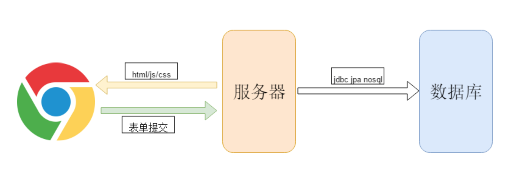
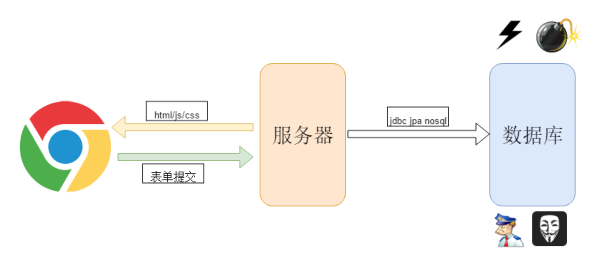
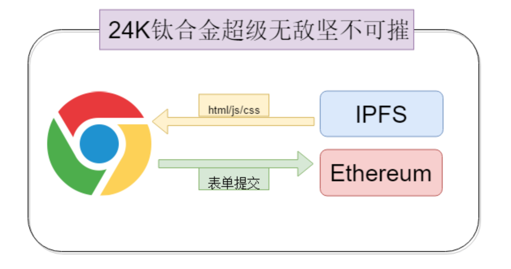
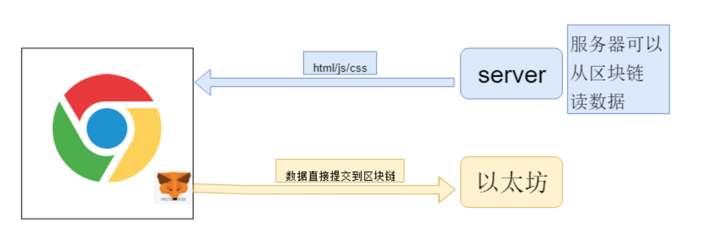
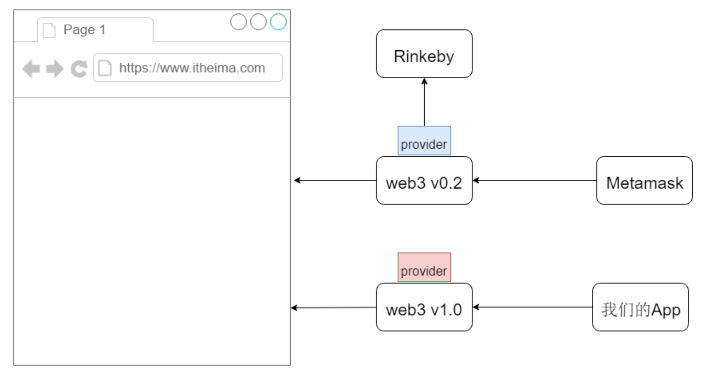
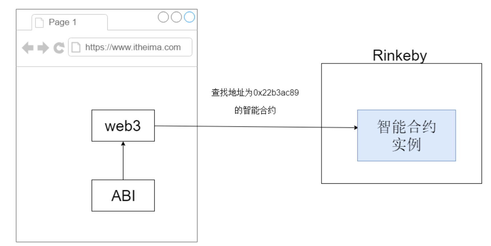

# 以太坊dapp应用程序结构

### server --- client 模式

- server -- database
- 传统模式,传统中心化数据库





### 区块链模式


server不予数据库交互 





private key 在用户端, server不会负责写任何数据

服务器端的业务逻辑, 大多数会迁移到 浏览器端. 前端要革了javaee程序员的命.


# 应用程序骨架(脚手架)

```shell
npm install -g create-react-app
create-react-app lottery-react
```

应用程序设计

1. 展示管理员地址
2. 展示奖池金额
3. 展示参与人数
4. 展示当前期数
5. 展示投注按钮
6. 展示开奖按钮(需要管理员界面才展现)
7. 展示退款按钮(需要管理员界面才展现)


# react 快速复习

- index.html
- src 下的css和app.js

```shell
# 启动应用程序
npm run start

# http://localhost:3000
```

### 初始化web3环境

```shell
npm install --save web3
```


# web3初始化



我们需要使用web3 v0.2的provider 注入到web3 v1.0的provider的里面

```js
// 创建一个web3.js
import Web3 from 'web3';
const web3 = new Web3(window.web3.currentPorvider);
export default web3;
```

import web3 from './web3'; 测试 console.log(web3.version); node编程中最重要的思想就是模块化，import和require都是被模块化所使用。

\###遵循规范 require 是 AMD规范引入方式 import是es6的一个语法标准，如果要兼容浏览器的话必须转化成es5的语法 ###调用时间 require是运行时调用，所以require理论上可以运用在代码的任何地方 import是编译时调用，所以必须放在文件开头 ###本质 require是赋值过程，其实require的结果就是对象、数字、字符串、函数等，再把require的结果赋值给某个变量 import是解构过程，但是目前所有的引擎都还没有实现import，我们在node中使用babel支持ES6，也仅仅是将ES6转码为ES5再执行，import语法会被转码为require


# 部署彩票智能合约

通过contract abi 和地址来调用 以太坊上的智能合约的实例 



相当于Java的 远程调用 webservice

deploy.js compile.js

要打印contract的地址.

要打印contract的json ABI


# 智能合约实例的部署和使用

1. 用compile脚本编译得到abi, 用deploy脚本得到address

```js
import web3 from './web3';
const address = '0x8ddddxxx';
const abi = [{"constant": true,...}]

export default new web3.eth.Contract(abi,address)
```


# 解析智能合约数据

react生命周期

| 时间线                   |      |
| ------------------------ | ---- |
| Component renders        |      |
| componentDidMount 被调用 |      |
| 'Call' 智能合约的方法    |      |
| set data 的state         |      |

```jsx
import lottery from './lottery';

constructor(props){
  super(props);
  this.state={manager:''}
}

async componentDidMount(){
  const manager = await lottery.methods.manager().call();
  this.setState({manager:manager});
}
return (
  <div>
    <h2>{this.state.manager}<h2>
  </div>
)
```


### Semantic UI

```shell
npm install --save semantic-ui-react
```

添加css

```html
<link rel="stylesheet" href="//cdnjs.cloudflare.com/ajax/libs/semantic-ui/2.3.1/semantic.min.css"></link>
```

根据需求设置ui


# 更多properties的初始化

```js
state = {
  manager:'',
  players:[],
  balance:''
};
await lottery.methods.getPlayers().call();
await web3.eth.getBalanace(lottery.options.address);
web3.utils.fromWei(this.state.balacne,'ether')
```


# 投注彩票

```jsx
 <input
    value = {this.state.value}
 	onChange = {event=> this.setState({value:event.target.value})}
 >

<button>
投注
</button>
```

```jsx
<form onSubmit={this.onSubmit}>
	
</form>


onSubmit = async ( event )=>{
    event.preventDefault();
    const accounts = await web3.eth.getAccounts();
    await lottery.methods.enter().send({
     	from:accounts[0],
        value: web3.eth.toWei(this.state.value,'ether');
    });
}
```

```jsx
<Button color='red' onClick={this.enter} loading={this.state.entering}>投注</Button>
enter = ()=>{
  this.setState({entering:true});
  setTimeout(()=>{
    this.setState({entering:false});
  },3000);
};
```


# 提示消息

this.setState({message:xxxx})


# 业务分析

exitscam.me

### 智能合约漏洞分析

```js
contract TimeLock {

mapping(address => uint) public balances;
mapping(address => uint) public lockTime;

function deposit() public payable {
    balances[msg.sender] += msg.value;
    lockTime[msg.sender] = now;
   increaseLockTime(1 weeks);
}

function increaseLockTime(uint _secondsToIncrease) public {
    lockTime[msg.sender] += _secondsToIncrease;
}

function withdraw() public {
    require(balances[msg.sender] > 0);
    require(now > lockTime[msg.sender]);
    msg.sender.transfer(balances[msg.sender]);
    balances[msg.sender] = 0;
}
}
```

这份合约的设计就像是一个时间保险库，用户可以将 Ether 存入合约，并在那里锁定至少一周。如果用户选择的话，用户可以延长超过1周的时间，但是一旦存放，用户可以确信他们的 Ether 会被安全锁定至少一周。有没有别的可能性？...

如果用户被迫交出他们的私钥（考虑绑票的情形），像这样的合约可能很方便，以确保在短时间内无法获得 Ether。但是，如果用户已经锁定了 100Ether 合约并将其密钥交给了攻击者，那么攻击者可以使用溢出来接收 Ether，无视 lockTime 的限制。

攻击者可以确定他们所持密钥的地址的 lockTime （它是一个公共变量）。我们称之为 userLockTime 。然后他们可以调用该 increaseLockTime 函数并将数字 2^256 - userLockTime 作为参数传入。该数字将被添加到当前的 userLockTime 并导致溢出，重置 lockTime[msg.sender] 为0。攻击者然后可以简单地调用 withdraw 函数来获得他们的奖励。


### 安全数学运算api

```js
contract SafeMath {
  function safeMul(uint256 a, uint256 b) internal pure returns (uint256) {
    if (a == 0) {
    return 0;
    }
    uint256 c = a * b;
    assert(c / a == b);
    return c;
  }

  function safeDiv(uint256 a, uint256 b) internal pure returns (uint256) {
    // assert(b > 0); // Solidity automatically throws when dividing by 0
    uint256 c = a / b;
    // assert(a == b * c + a % b); // There is no case in which this doesn't hold
    return c;
  }

  function safeSub(uint256 a, uint256 b) internal pure returns (uint256) {
    assert(b <= a);
    return a - b;
  }

  function safeAdd(uint256 a, uint256 b) internal pure returns (uint256) {
    uint256 c = a + b;
    assert(c >= a);
    return c;
  }
}
```


### 工具api 强制刷新页面

window.location.reload(true);

```js
async componentDidMount(){
  const web3 = new Web3(window.web3.currentProvider);
  const account = await web3.eth.getAccounts();
  console.log(account[0]);
  if(account[0] === '0xD53a291C6807eebCA371a3aF9Cb40Bb7556B7DC4'){
    this.setState({display:'inline'})
  }else{
    this.setState({display:'none'});
  }
  this.timer();
}

style={{display:this.state.display}}
```


