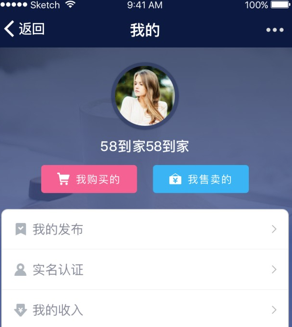
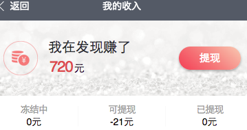
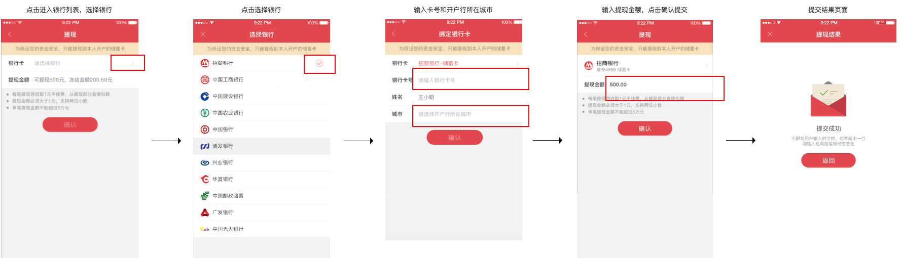
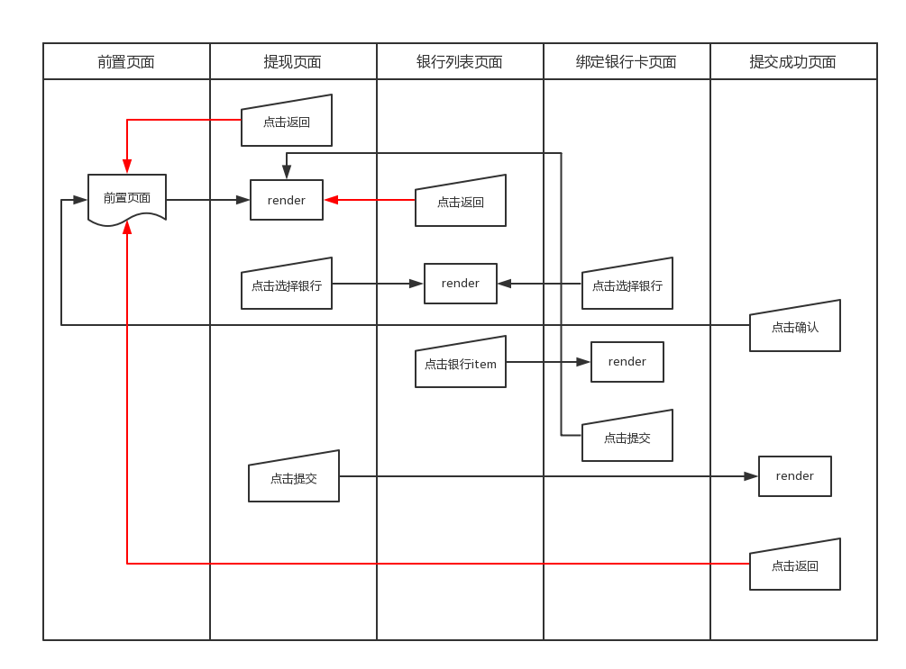
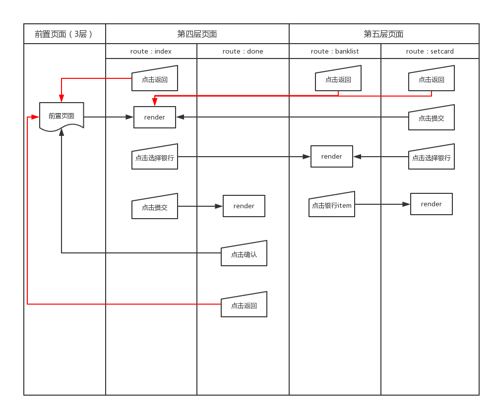

# 页面路径最多五层？导航可以这么玩

微信[小程序](http://www.wxapp-union.com/)提供[导航相关的API](https://mp.weixin.qq.com/debug/wxadoc/dev/api/ui-navigate.html?t=20161122)：

- `wx.navigateTo()`;
- `wx.redirectTo()`;
- `wx.navigateBack()`。

使用`wx.navigateTo()`或者[``](https://mp.weixin.qq.com/debug/wxadoc/dev/component/navigator.html?t=20161122)组件跳转的页面路径最多只有5层，这些页面路径是可以通过`wx.navigateBack()`API或者左上角返回按钮按顺序返回的。当页面路径大于5层时，使用`wx.navigateTo()`进行下一页吗跳转会抛出错误：

```
navigateTo:fail webview count limit exceed.
```

但是某些业务场景存在多页面互动的交互逻辑，远远不止5层页面栈。比如笔者近期参与开发的58到家小程序中存在如下的业务场景：
1、用户进入小程序，展示首页；
2、首页存在一个如下图的底部导航栏：

[](http://www.wxapp-union.com/data/attachment/portal/201612/20/000710bnnp92zfuejtdidu.png)

用户点击“我的”进入个人中心，此时页面栈为**首页->个人中心**，共2层。
3、个人中心页面存在“我的收入”入口，如下：

[](http://www.wxapp-union.com/data/attachment/portal/201612/20/000710sf8ahssxavukekop.png)

4、用户从个人中心进入我的收入页面，此时页面栈为**首页->个人中心->我的收入**，共3层；
5、我的收入页面提供“提现”页面的入口，如下：

[](http://www.wxapp-union.com/data/attachment/portal/201612/20/000711dc8qsa3cot1a22bs.png)

6、用户进入提现页面，此时的页面栈为**首页->个人中心->我的收入->提现**，共4层。此时留给我们可支配的页面栈只剩下一层了。提现流程如下：

[](http://www.wxapp-union.com/data/attachment/portal/201612/20/000711nhxzqhizoyxiuyrm.png)

提现流程存在多页面直接的数据共享和交互，如果是常规的webapp，我们通常会考虑使用hash路由或者干脆做成独立的几个页面使用url传参进行数据通信。但是进入提现页面之后，我们最多只能再添加一个独立页面了。也就是说，银行列表页、绑定银行卡页和提交成功页三者只能再使用一个页面栈（并非一个页面）承载。如何用仅剩的最后一层页面栈实现上述复杂的提现流程呢？

### 逻辑行为梳理

#### 第一步：细分交互行为

首先第一步是将提现行为细分，因为只能再添加一个独立页面，所以需要合并一些可在一个页面完成的行为。上文的流程图其实遗漏了一个行为：**绑定银行卡页面点击银行卡需要显示银行列表页**。也就是允许用户重新选择银行。所以其实整体的提现流程如下：

[](http://www.wxapp-union.com/data/attachment/portal/201612/20/000711ifpv4qfee97iv5h4.png)

> 小程序标题栏左上角返回按钮的行为（图中标红的线条）是返回页面栈的上一页面，代码是无法干预的。

整个流程中必须支持“返回”按钮正常返回上一页面的行为有：

- 前置页面进入提现页面，正常返回前置页面；
- 提现页面进入的银行列表页面，正常返回提现页面。

要保证第二条“提现页面进入的银行列表页面，正常返回提现页面”，就必须将银行列表页独立为一个页面。至此，最后一层页面栈就定型了。那么剩下的绑定银行卡和提交成功页面怎么办呢？

#### 第二步：合并逻辑页面

需要注意的是，银行列表页面与绑定银行卡页面之间有一个**双向**的交互行为，由于最后一个独立页面已经确定为银行列表页了，所以不得不从中牺牲一定的用户体验：**绑定银行卡页面跳转到银行列表页后不能正常返回**。有了这个前提，我们可以**把银行列表和绑定银行卡两个逻辑页面合并为一个实体页面，通过子路由控制行为展示**。

再次回顾上文的交互流程图还可以得到另外一个信息：提交成功页面的返回逻辑与提现页面完全相同。所以，两者同样可以合并为一个实体页面，由子路由控制行为展示。

#### 第三步：梳理行为逻辑

以第二步的合并规则为准，实体页面的交互流程如下：

[](http://www.wxapp-union.com/data/attachment/portal/201612/20/000712v0crcaeesz7xzh5b.png)

### 使用`data.route`实现子路由

微信小程序的Page是没有子路由概念的，我们在此讨论的子路由其实就是**根据Page组件的某个data字段进行不同模板的分发渲染**。

首先定义支持的子路由列表：

```
// 路由列表
const ROUTES = {
  index: 'index',
  banklist: 'banklist',
  setcard: 'setcard',
  done: 'done'
};
```

我们在代码上又进一步的融合，将第四层页面和第五层页面两个实体页面融合为同一个Page组件，通过子路由控制模板的渲染，之所以这样做有以下几点考虑：

1. 两个实体页面之间有很多共用的数据；
2. 58到家的小程序是复用了现存的部分接口，两个页面之间的数据是混合在一起的，融合也是为了避免接口的重构；

既然融合为一个Page组件，那么如何实现页面的跳转呢？其实很简单，使用`wx.navigateTo()`API如下：

```
wx.navigateTo({
  url: './index?route=' + ROUTES.banklist
});
```

上述代码实现了跳转到同一Page组件的功能，并且跳转的页面会被加入到页面栈中。

然后在`index.wxml`中增加路由数据的逻辑判断分发：

```
<block wx:if="{{route=='index'}}">
  <include src="_part/basic/index.wxml"/>
</block>
<block wx:if="{{route=='banklist'}}">
  <include src="_part/banklist/index.wxml"/>
</block>
<block wx:if="{{route=='setcard'}}">
  <include src="_part/setcard/index.wxml"/>
</block>
<block wx:if="{{route=='done'}}">
  <include src="_part/done/index.wxml"/>
</block>
```

前置页面进入第四层页面时默认的是`index`子路由页面，有第五层页面的绑定银行卡提交后返回第四层页面时显示`done`子路由。这个逻辑中需要注意的是：

- 第四层页面跳转第五层页面是隐藏（Hide）而不是卸载（Unload）；
- 第五层页面返回第四层页面后会触发第四层页面的`onShow`钩子函数。

也就是说，我们可以再`onShow`钩子函数中进行路由的分发。但是如何获取路由字段呢？大家可能想到的第一个方案就是通过url传参，可惜这个方案是行不通的。首先，微信小程序[官方文档](https://mp.weixin.qq.com/debug/wxadoc/dev/framework/app-service/page.html?t=20161122)中关于Page组件钩子函数的说明，只有`onLoad`函数可以获取由url query传递的数据，其余的任何钩子函数都不能获取；其次，第五层页面的提交行为返回第四层页面是由`wx.navigateBack()`API实现的，这个API的功能是返回页面栈中的上一层页面，并不支持指定的修改url，所以url传参这条路是走不通的。

那么使用cookie是否可行呢？虽然微信小程序不支持cookie，但cookie的理念可以提供给我们解决问题的思路：将数据先储存在本地，跳转页面后获取本地数据进行相应处理。

有了思路，自然而然地便想到类似cookie的[本地storage](https://mp.weixin.qq.com/debug/wxadoc/dev/api/data.html#wxsetstoragesynckeyvalue)。

### 使用storage进行页面间的数据通信

第一步：点击第五层页面的提交按钮后，首先在storage中储存第四层页面的route值：

```
wx.setStorage({
    key: 'dj_deposits_route',
    data: ROUTES.done
});
```

第二步：在第四层页面的`onShow`函数内获取storage中的route数据并赋值给data中的route字段，模板便会同步刷新：

```
let _route = wx.getStorageSync('dj_deposits_route');
this.setData({
    route: _route
});
```

### 总结

微信小程序的页面路径限制为最多5层，多于5层的页面将不会跳转并且会抛出错误信息。而我们产品的某些业务场景不止存在5层的页面路径，在这种情况下，我们不得不牺牲一定的用户体验，以保证功能的完整。本文提到的方案是与业务场景息息相关的，只是一家之言，并非最佳实践。希望能够给大家一点参考。