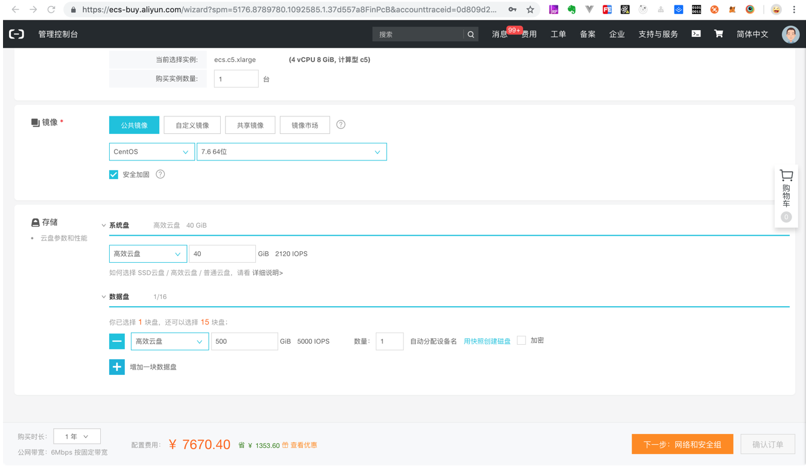
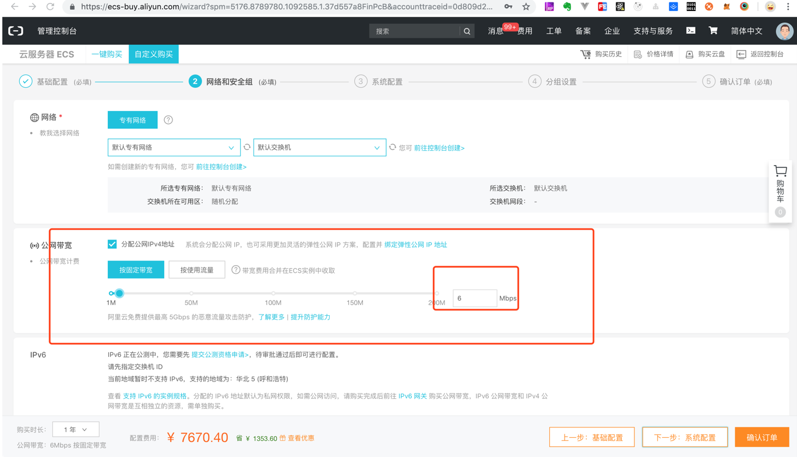
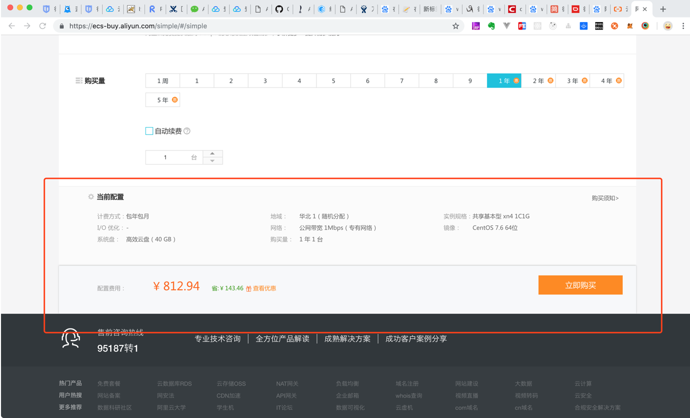
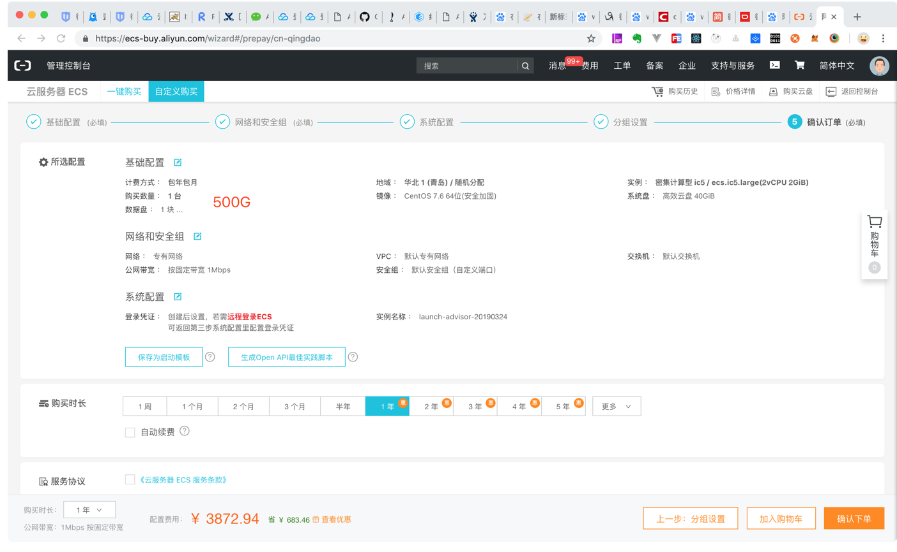
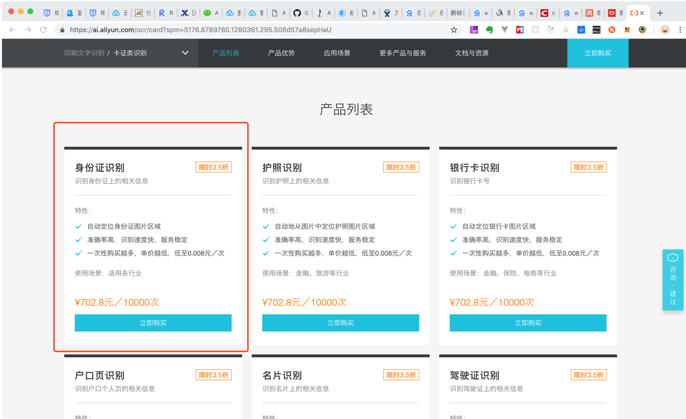
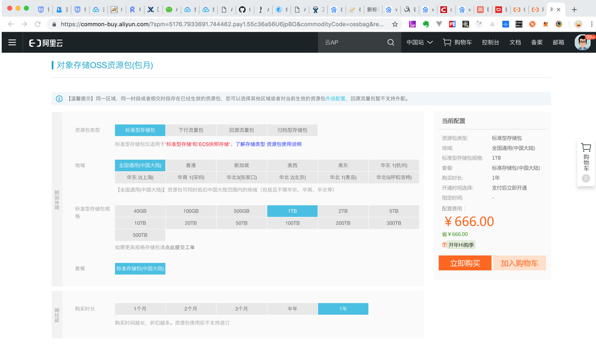
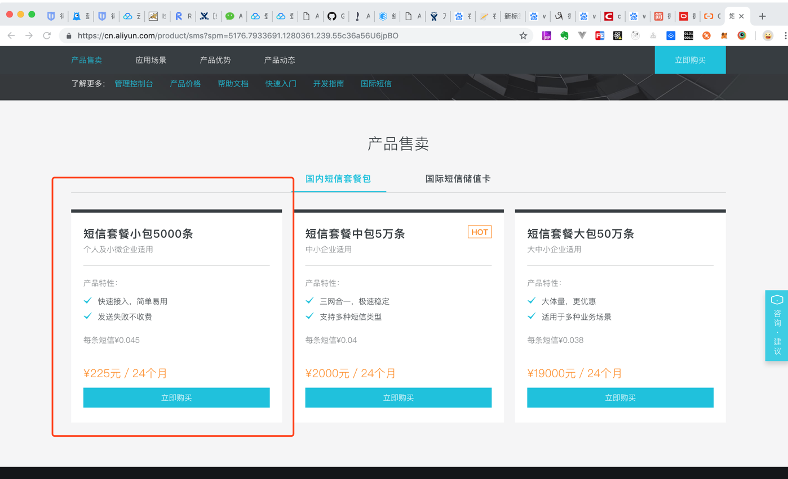

# 需要申请的账号

1.域名：<https://wanwang.aliyun.com/>

2.服务器：<https://ecs-buy.aliyun.com/> 

​    根据前期业务量和用户量，服务器配置如下

​    (1).生产环境服务器配置（一年）

​        1.4核CPU 

​        2.8G内存 

​        3.操作系统Centos 7.6 

​        4.存储，系统盘40G， 数据盘500G

​        5.公网宽带6M

(2).测试（一年）

(3).预发布环境（一年） 

​       1.2核CPU  

​        2.2G内存  

​        3.操作系统Centos 7.6 

​        4.存储，系统盘40G， 数据盘500G 

​        5.公网宽带1M 

3.身份证识别接口：<https://ai.aliyun.com/ocr/card?spm=5176.8789780.1280361.295.508d57a8sepHaU>

4.对象存储OSS资源包：<https://common-buy.aliyun.com/?spm=5176.7933691.744462.pay1.d4176a56Pstf0m&commodityCode=ossbag&request=%7B%22region%22%3A%22china-common%22%7D#/buy>

5.短信服务：<https://cn.aliyun.com/product/sms?spm=5176.7933691.1280361.239.55c36a56U6jpBO>

6.微信开放平台:<https://open.weixin.qq.com/> 

​    (1)微信支付、分享、登录等
 

7.腾讯开放平台: <https://open.tencent.com/> 

   (1) APP的QQ登录、内容到分享QQ和QQ空间、安卓端APP应用宝应用上架
 

8.极光推送：<https://www.jiguang.cn/> 

​    (1)App消息推送

9.苹果开发者账号：<https://idmsa.apple.com/IDMSWebAuth/login?appIdKey=891bd3417a7776362562d2197f89480a8547b108fd934911bcbea0110d07f757&path=%2Fenroll%2Forganization%2F&rv=1> 

​    （1）IOS应用上架
 

10.百度地图：<http://lbsyun.baidu.com/> 

