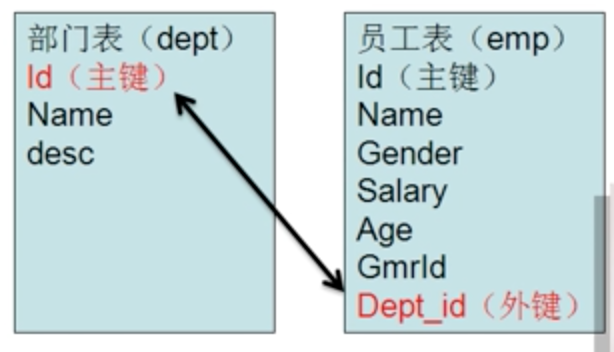

# MySQL多表查询之外键

## 一、什么是外键

主键是唯一标识一条记录，不能有重复的，不允许为空，用来保证数据完整性。

表的外键是另一个表的主键，外键可以有重复的，可以是空值，用来和其他表建立联系用的。




## 二、外键的语法

添加外键语法

[CONSTRAINT symbol] FOREIGN KEY [id] (index_col_name, ...)

REFERENCES tbl_name(index_col_name, ...)

[ON DELETE {RESTRICT | CASCADE | SET NULL | NO ACTION}]

[ON UPDATE {RESTRICT | CASCADE | SET NULL | NO ACTION}]


## 三、外键的条件

外键的使用需要满足下列的条件：

1. 两张表必须都是InnoDB表，并且它们没有临时表
2. 建立外键关系的对应列必须具有相似的InnoDB内部数据类型
3. 建立外键关系的对应列必须建立了索引
4. 假如显式的给出了CONSTRAINT symbol，那symbol在数据库中必须是唯一的。假如没有显式的的给出，InnoDB会自动的创建。


## 四、添加外键

示例：

```shell
alter table emp add foreign key(did) references dept(did);
```

在员工表的did字段上添加外键约束


## 五、删除外键

通过查看表的定义找出外键的名称

```shell
show create table emp;
```

删除外键

```shell
alter table emp drop foreign key 外键名
```


