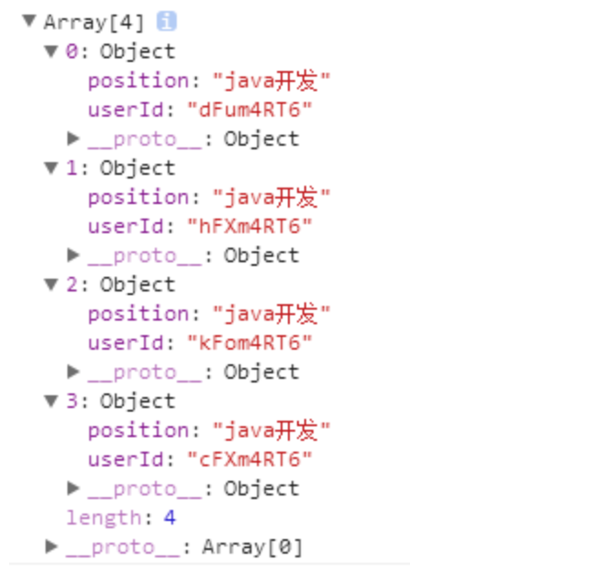

## 使用reduce去除数组中重复对象

```js
// 使用reduce去除数组中的重复数据，亲测可用：
var data = [
    {"userId":"dFum4RT6","position":"java开发"},
    {"userId":"hFXm4RT6","position":"java开发"},
    {"userId":"kFom4RT6","position":"java开发"},
    {"userId":"cFXm4RT6","position":"java开发"},
    {"userId":"hFXm4RT6","position":"java开发"},
]
var hash = {};
arr = data.reduce(function(item, next) {
  hash[next.userId] ? '' : hash[next.userId] = true && item.push(next);
  return item
}, [])
console.log(arr);
```

打印结果：



