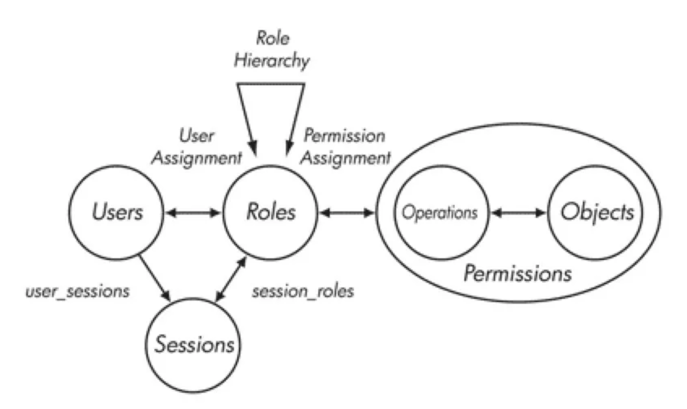
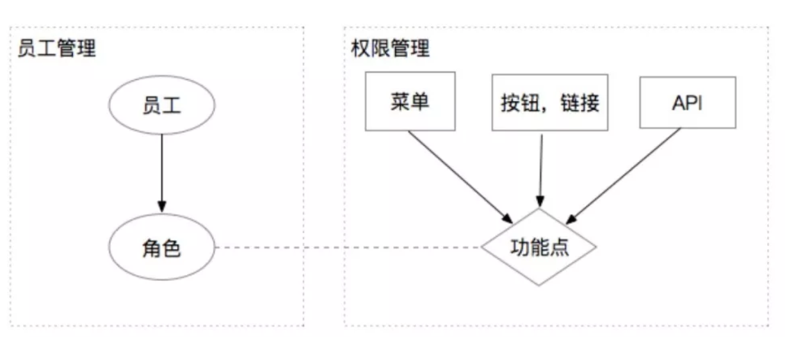
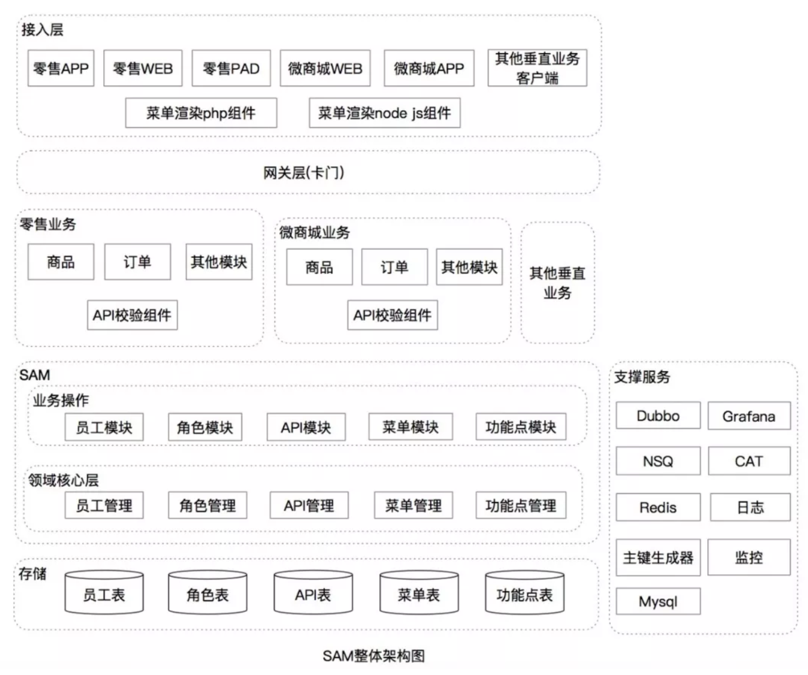
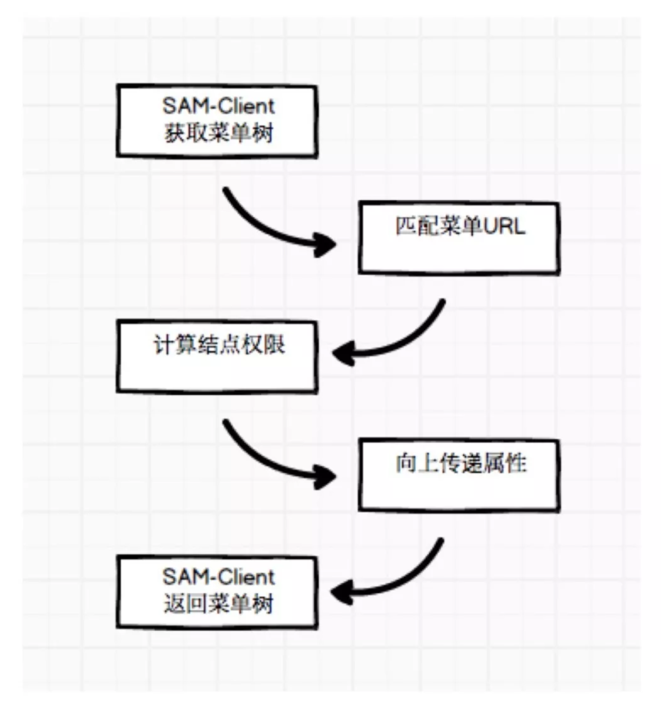
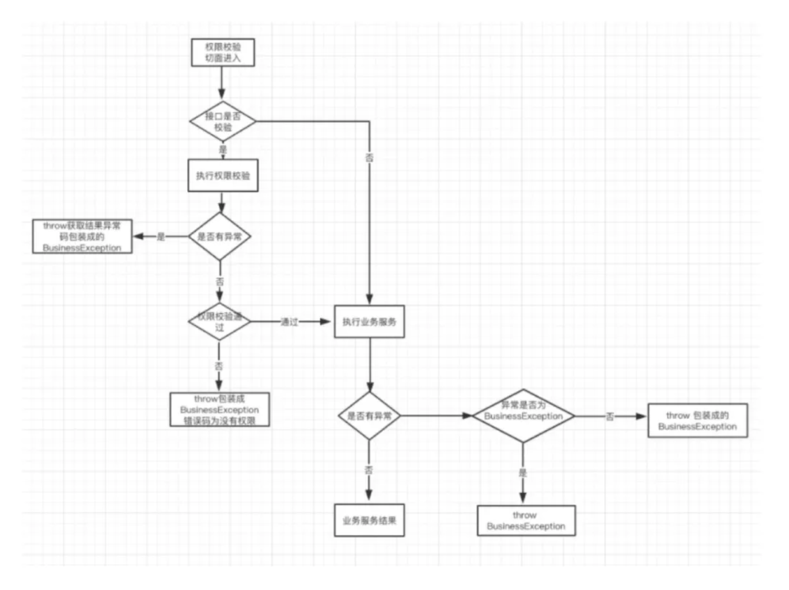
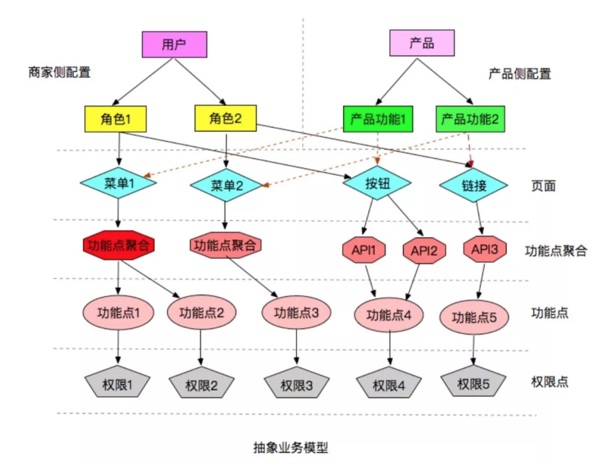
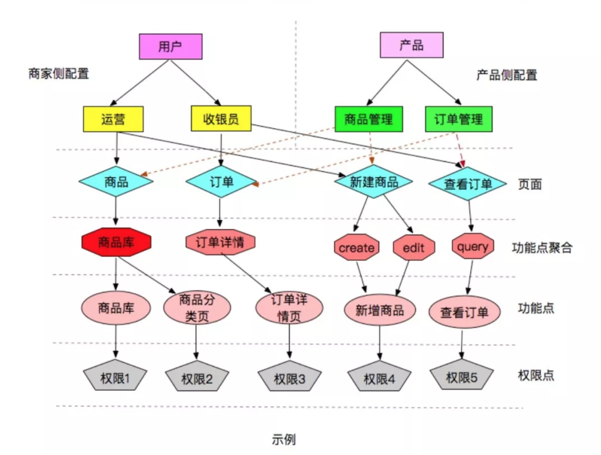

## 有赞权限系统

有赞作为一个商家服务公司，通过产品和服务，帮助互联网时代的生意人成功。在新零售的浪潮下，有赞零售为商家提供不同规模的门店和网店经营解决方案，帮助零售商家们快速进入新零售时代。

与传统网上商城场景不同，零售面对着全新的业务场景和难题，一家运转成熟的新零售店铺，通常需要包括老板、店长、客服、收银员、核销员、仓管、财务等十余个不同能力的角色分工、搭配。摆在零售商家们眼前的一大难题是，**如何优雅的管理各个员工，自由分配角色，无痛又润滑地解决员工角色管理问题。**

在充分分析零售行业业务场景，员工角色管理方案的不断探索讨论后，权限系统 SAM(Security Access Manager)应运而生，**SAM 是有赞零售在员工角色权限管理道路上探索的里程碑，支持着零售 PC、App 和 Pad 产品的权限业务，任何一家使用了有赞零售的零售店都可以通过 SAM 权限系统提供的服务来灵活的给店里员工灵活分配角色，责任到人，以此提高店铺运转效率**；支撑零售业务的同时，抽象出了一套权限管理框架，对其他业务线产品（微商城）进行同样支持。

在介绍 SAM 系统之前，首先以几个案例来理解权限系统的概念和设计。

计算机世界中的许多事物是现实世界的一个阴影，现实中所见的许多模式/概念在计算机世界里都能找到。曾记否，QQ 里隐身对她可见，怕她看不见，下线又上线，却依旧被视而不见；曾记否，亲密无间的恋人们，分手后变成了最熟悉的陌生人，悲痛伤心之余，微信、电话、 QQ 拉黑。这些案例，都是计算机权限系统对现实世界的一个映射，你对女神隐身可见，实际上是赋予了她可以看到你的隐身状态（真实状态）的权限，当然你也赋予了人家伤害你的权限；恋人们把对方拉到了黑名单用户组，这样一来，他们就看不见相互动态，成为最熟悉的陌生人；从此，从你的全世界路过。

RBAC

上面例子，我们可以抽象出这样的模式：“ Who 对 What(Which)进行 How 的操作” 。例如，恋人们的例子，在你拉黑对方后，在朋友圈中你(Who)将看不到(How)对方的消息(What)。这是一个经典的 RBAC（基于角色的权限访问控制）权限模型。RBAC 认为权限授权实际上是 Who、What、How 的问题。在 RBAC 模型中，Who、What、How 构成了访问权限三元组,也就是“Who（权限的拥用者或主体）对 What(Which)（权限针对的对象或资源）进行 How（具体的权限）的操作”。

RBAC 模型引入了“角色”的概念。所谓“角色”就是一个或一群用户在系统中可执行操作的集合，它是一个用户的集合，又是一个授权许可的集合。通过将角色指派给用户，为角色赋予权限的方式，使用户和权限通过角色间接相联系。RBAC 基本模型如图所示：



在 RBAC 中，用户与角色之间、角色与权限之间都是多对多的关系。会话是一个用户对多个角色的映射，此时的用户权限可以为激活角色权限的并集。RBAC 对资源授权管理过程分为两个部分，首先实现访问权限与角色相关联，然后再实现角色与用户相关联，从而实现了用户与访问权限的逻辑分离。

## 权限系统 SAM

### SAM 权限系统模型设计

RBAC 模型不同于强制存取控制以及自由选定存取控制直接赋予使用者权限，是将权限赋予角色。在 RBAC 中，权限与角色相关联，用户通过成为适当角色成员而得到这些角色的权限，角色可依新的需求和系统的合并而赋予新的权限，而权限也可根据需要而从某角色中回收。RBAC 相对于传统访问控制更为中性且更具灵活性的存取控制技术。从一家零售店铺员工角色管理角度看，设置角色是为了完成各种工作而创造，员工则根据它的责任和资格来被指派相应的角色，员工应该可以很容易地从一个角色被指派到另一个角色。因此，零售选择了基于 RBAC 模型来实现权限系统解决商家们管理员工角色问题。

依据 RBAC 模型思想，SAM 权限系统业务模型设计为员工管理和权限管理两部分，员工管理主要指管理员工以及为员工指派角色，权限管理主要指管理菜单、页面、按钮、API 等资源，通过定义最基本的业务功能点作为权限点，实现管理角色对资源主体的请求，构成“用户-角色-权限-资源”的授权模型。



下面是 SAM 权限系统模型中的一些通用语言：

- 员工：角色的载体，权限的实行者
- 角色：角色是权限集进一步映射。业务系统可动态管理角色,各业务为方便用户使用可提供给默认角色列表，满足不同的员工权限
- 权限点：全局唯一的用来表示某一个功能点对应的权限的状态
- 功能点：逻辑上定义的用来描述系统资源的最小基本单位，每一个功能点都对应唯一一个权限点
- 功能集(权限集)：即功能点的集合，有一组功能点按照特定格式进行组合
- API：请求系统资源的通道和动作，拥有功能集属性
- 菜单：将系统资源组织后展示给请求者的入口，拥有功能集属性
- 页面：被当做一种特殊的菜单，拥有 URL 属性
- 按钮：页面中更细粒度的资源入口，被当作一种特殊的菜单

### SAM权限系统模型的实现

在传统的 RBAC 模型中，通常通过一张关系表来保存角色与权限集的对应关系，实现权限与角色相关联。可以预见的是，随着零售业务的不断发展会积累下不计其数的功能点，导致关联表的数据极难维护和使用。SAM 权限系统利用进制转换的策略解决了这个问题 ，同时提高了存储效率以及权限判定效率。一个基本类型为 Long 的十进制数字，它也可以看做是由 64 位 0 或 1 组成的二进制。在 SAM 系统模型设计中，每一个功能点定义为一个权限点，该权限点由 idx 和 pos 两个属性确保是全局唯一的权限点。idx 表示第几个 Long 型空间，pos 表示 Long 型对应的二进制数中所处的位置，64 位长度即可代表 64 个不同能功能点。当 64 位满时无法再容放更多的功能点，这时 idx 属性会自增，重新申请一个 Long 型空间。如此一个 64 位的 Long 数字，通过 0 或 1 的组合，即可表示最多对 64 个不同的功能点所拥有权限的状态描述。

例如：权限集{1}表示拥有 idx=0, pos=0 对应功能点的权限，权限集{-1,1}表示拥有idx=0,pos∈[0,1,2,..,63]与 idx=1,pos=0 对应功能点的权限。

SAM 权限系统将资源与所代表的功能点的关联关系通过进制的方式管理起来，采用计算机进制的思想，抽象出功能集换算公式来完成资源与二进制之间的映射，以及角色与二进制的映射。

权限集换算公式：
{(idx0,pos0),(idx0,pos1)…(idxN,posM)} => {Long0,Long1…LongN}

SAM 权限系统同样通过进制思想实现“ Who 对 What 进行了 How 的操作”，角色请求某个资源（菜单/API）时，通过权限校验计算公式——进制按位“与”运算操作的思想（见下）得出该角色是否拥有访问资源的权限。采用进制来实现运算，权限判定的效率会变得更加的高效。例如，一个仓管在点击一个商品库存菜单时，背后的权限校验计算公式，其实是将角色的权限集与资源的权限集进行按位与计算，任意一对序号为 idx 的 Long 算得不为 0，即两集合有公共的功能集，认为该角色拥有对资源访问的权限。

权限校验计算公式：
{Long0,Long1…LongN} & {Long0,Long1…LongM}

SAM 权限系统模型的实现遵循 RBAC 模型中的最小权限原则，责任分离原则和数据抽象原则三大原则，通过最小权限原则可以将角色配置成其完成任务所需要的最小的功能集；有了责任分离原则可以通过调用相互独立互斥的角色来共同完成敏感的任务而体现，比如要求一个仓管和商品管理员共同参与一个商品。数据抽象则可以通过权限的抽象来体现，如仓管操作商品发货，库存管理等抽象权限，而不用操作系统提供的典型的读、写、执行权限。

### SAM 权限系统架构

零售通过 PC、App 和 Pad 来满足不同商家的终端需求，因此 SAM 权限系统需要满足零售不同客户端权限业务场景，同时也要支持微商城产品权限业务。SAM 权限系统采用微服务的方式对外提供服务，采用分布式分层架构实现，主要包括客户端和服务端两部分，客户端以轻量的方式嵌入在业务系统，提供给不同业务系统实现角色访问资源的控制；服务端通过提供 Dubbo 服务，Nova 服务跟客户端进行交互。服务端主要对员工，菜单，角色，API，功能点进行数据管理。SAM 作为基础服务，每天的请求量巨大，通过 Redis 缓存来解决性能问题，选用 Druid 作为数据库连接池，管理着数据库的连接以及释放。同时，通过对接天网监控平台来观察系统运行状态，提高系统的稳定性。


有赞零售系统基于 SAM 实现的角色对于资源的访问控制主要是 API 校验和菜单渲染，任何一家零售店登入有赞零售系统后，点击页面中的某一个菜单或者页面元素（按钮，链接…），都会进行菜单渲染以及 API 接口的校验。由于两部分调用量巨大，同时不同的客户端请求量不同，防止相互之间干扰，因此将菜单渲染，API 校验等能力在不同的客户端中各自实现。

#### 菜单渲染

SAM 通过客户端的方式进行接入，菜单渲染在客户端一侧进行。目前 SAM 已经提供了 php/node js 两套客户端，供 web 层进行接入和渲染。
菜单渲染的过程可以分为三点：

一、结点定位

按照系统功能的划分，菜单通常以一棵树的形式进行展现。以零售 PC 后台为例，所有在页面中展示的元素，都认为是一种菜单，这样的菜单元素包括：菜单、页面、按钮。在后台访问时，用户停留的菜单通常是页面，页面有一个全局唯一的属性：URL，往上：可以通过父菜单找到根结点，往下，页面下可能包含一些子菜单——按钮。因此 SAM 只需要根据当前请求的 URL，即可在后台菜单树中定位到唯一的页面菜单，同时获得该菜单的结点路径以及拥有的按钮。

二、权限计算

我们已经获得了用户的角色权限和完整的菜单树，根据每个菜单结点的权限集，可以计算出当前用户对结点的访问权。根据计算结果，客户端对菜单可以进行区分渲染，比如：用户通过拼 URL 访问一个无权限页面时会提示非法，无权限访问的菜单和按钮会自动置灰不可点击。

三、属性传递

默认菜单不具备 URL 属性。菜单的 URL 属性通过子菜单的 URL 传递生成，SAM 会选择第一个有权限的子菜单的 URL 作为父结点的属性，并逐级传递到一级菜单。



#### API 权限校验

零售系统中除了菜单外，API 是另一种被请求的资源类型。API 校验是除了菜单渲染外另一道权限控制的保障。通过卡门（ API 网关）的 API 请求转发到具体业务系统时，嵌入在业务系统中的 SAM API 校验客户端会首先通过上面的权限校验计算公式对该角色是否具有权限访问这个 API 进行判定，若权限校验通过则执行后面业务逻辑。

具体流程如下图所示



API 权限校验的伪代码实现:

```python
#权限不通过错误码提示信息
AUTHPERM_ERROR(231000401,"您没有权限执行该操作!")
# 织入点
@Before("@annotation(com.youzan.sam.common.Auth)")
# 切面处理方法
def handle(JoinPoint pjp):
    # 可以启动时或者运行时控制该开关是否对API进行权限校验
    if(!enable):
         return
    # 权限校验结果包装对象
    def pass=checkPermission()
    # 权限校验执行成功
    if (pass.isSuccess()):
       # 权限校验通过
       if(pass.getData().get("isSuccess")):
         return
       # 权限校验不通过
       else:
         throw new BusinessException(AUTHPERM_ERROR.getCode,AUTHPERM_ERROR.getMessage());
    # 权限校验执行失败
    else:
       throw BusinessException(pass.getCode(), pass.getMessage())

# 权限校验方法
def checkPermission():
    # 判断是否需要走权限校验，对于某些内部调用可以直接跳过
    {...}
    # 获取卡门（API网关）隐式参数,运用了dubbo的隐式传参的能力
    def kdt_id=RpcContext.getContext().getAttachment(Constants.KDT_ID_KEY)
    def admin_id=RpcContext.getContext().getAttachment(Constants.ADMIN_ID_KEY)
    def service = RpcContext.getContext().getAttachment(Constants.SERVICE_KEY)
    def method = RpcContext.getContext().getAttachment(Constants.METHOD_KEY)
    def version = RpcContext.getContext().getAttachment(Constants.VERSION_KEY)
    # 上述参数的校验
    {...}
    # 通过StaffPermServiceProxy获取角色的权限集
    def staffPerm=StaffPermServiceProxy.getStaffPerms(adminId, kdtId)
    # 通过APIPermServiceProxy获取API的权限集
    def apiPerm=APIPermServiceProxy.getServicePerms(service, version, method)
    # 运用权限校验计算公式判定该角色是否可以访问此API
    {...}
    # 返回结果
    return pass
```

API 权限校验流程可以总结如下：

1. 业务方在对应需要权限校验的 API 上标注 @Auth 注解，Spring 框架会在初始化创建业务 bean 的时候，扫描该 bean 是否有 @Auth 注解标注的方法，对于有 @Auth 注解标注的，会创建代理类，然后会将该权限切面织入到代理类中；
2. 业务调用有 @Auth 注解标注的方法时，会执行该权限校验切面逻辑，首先检查权限校验开关，判断是否需要权限校验，该开关可以在运行时动态设置；
3. 如果需要，再调用 AuthService 的权限校验方法，AuthService 会根据店铺 ID 与用户 ID 从 SAM 服务端获取员工角色权限信息，根据卡门（API 网关）隐式参数中 service，method，version 去 SAM 服务端获取对应 API 权限(相对于在对应 API 上直接标注权限点，这种方式更加的灵活，而且可以随着业务 API 版本的升级，进行很方便的升级，同时结合卡门（ API 网关）可以对 API 进行分流，不同的商家可以对应不同 API 的权限校验。
4. 在获取到角色权限集和 API 权限集后，基于上面的角色与权限校验逻辑进行权限校验。校验通过，则正式发起 API 请求。校验不过，则提示无权限。

## SAM权限系统抽象模型

产品在分析完需求后，将需求交由开发去完成。SAM 权限系统支撑着零售业务的同时，也支撑着微商城业务。 零售各个模块就有不同的产品支撑着，为了更好的满足服务商家的需求，以及方便产品们的分析。SAM 权限系统可以抽象成如下模型，商家和产品可以从各自不同的视角，去对接 SAM 权限系统。例如，下图所示商家想要一个运营的角色需要有新建商品，以及查看订单的能力，同时需要一个收银员只有查看订单的能力。产品从自己的设计角度分析，对应的就是商品管理，订单管理的模块，对应的模块下有对应的商品，订单菜单，最后将角色的权限体现在页面元素和 API 上，例如新建商品的按钮，以及查看订单的按钮会呈现不同的渲染样式；按钮触发对应的是与后端交互的不同 API，不同的角色具有 API 的不同执行能力。





## 未来展望

### 自定义角色

在了解商家需求后，零售提供了 8 大默认角色来支持单店版的员工角色问题。零售业务错综复杂，默认角色很多时候并不能对付所有场景，现在一些自定义角色已经在某些零售店使用。未来自定义角色将全线支持各个商家，定制任意权限的任意角色。

### 多角色

有些零售商家为了缩减人力成本，一个员工常常担任多个角色，因此需要提供一个员工多角色的能力。零售业务已经在使用多角色的能力。

### 零售中台的支持

零售中台是有赞零售的一个旗舰型产品，旨在为商家提供一个覆盖线上多渠道线下多门店的全渠道解决方案，并利用数据化运营思路帮助商家拉新获客、提高复购。其业务形态非常复杂，涉及到多种角色和权限的组合，而且每个商家可能存在一些个性化需求，如何提供灵活的适配能力是 SAM 系统的一个挑战。

### 自定义菜单

过去后台功能的发布上线，往往是由发布系统控制，发布则功能即刻上线，一旦发现故障立时回滚。SAM 通过菜单管理，可以实时控制线上的任意菜单、页面和按钮的渲染状态，从容地上下线页面和功能。

### 技术改造

SAM 作为零售以及其他业务的公共基础组件，需要打造成一个高可用，高性能，易扩展，可伸缩且安全的系统。随着业务的不断接入，通过对系统的不断改造来支撑业务的不断发展。