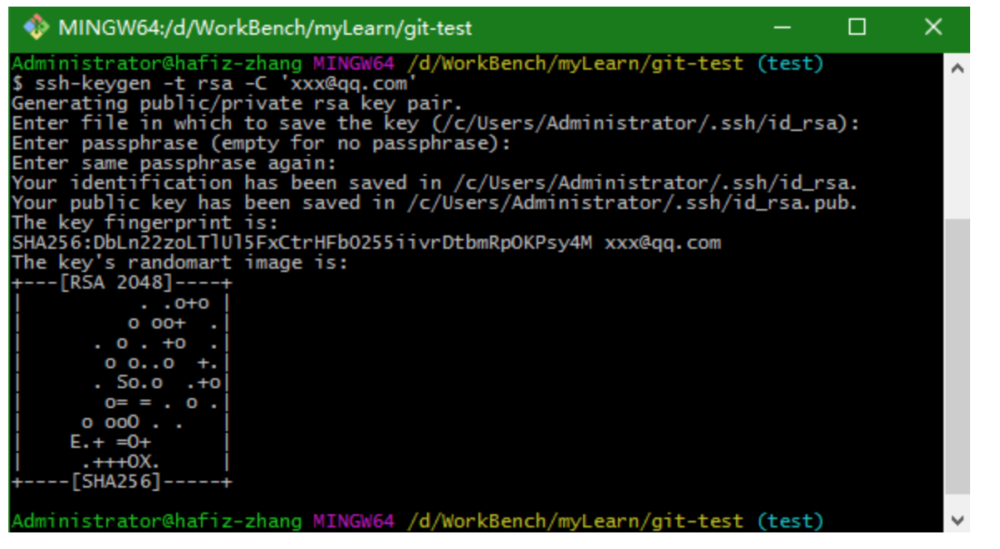
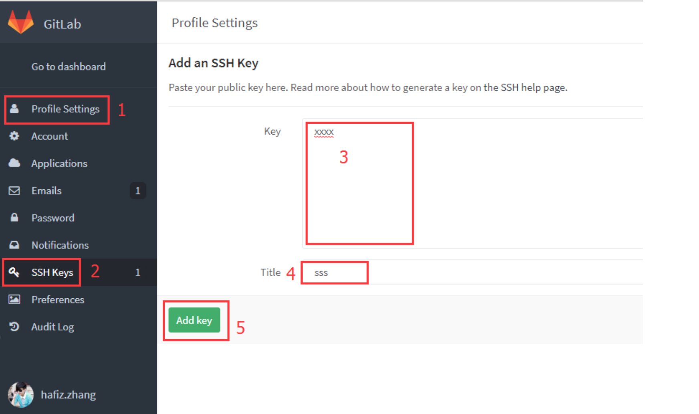

# GitLab配置ssh key

### 一、背景

 	当前很多公司都选择git作为代码版本控制工具，然后自己公司搭建私有的gitlab来管理代码，我们在clone代码的时候可以选择http协议，当然我们亦可以选择ssh协议来拉取代码。但是网上很少找到如何用git客户端生成ssh key，然后配置在gitlab，我当时在做的时候苦于摸索，后来终于找到了解决方案，那么本文，我们就来聊一聊如何本地git客户端生成ssh key，然后配置在gitlab里，而后使用ssh协议进行提交和拉取git远程仓库的代码。


### 二、解决方案

1.打开本地git bash,使用如下命令生成ssh公钥和私钥对

`ssh-keygen -t rsa -C 'xxx@xxx.com'` 然后一路回车(-C 参数是你的邮箱地址)



2.然后打开~/.ssh/id_rsa.pub文件(~表示用户目录，比如我的windows就是C:\Users\Administrator)，复制其中的内容

3.打开gitlab,找到Profile Settings-->SSH Keys--->Add SSH Key,并把上一步中复制的内容粘贴到Key所对应的文本框，在Title对应的文本框中给这个sshkey设置一个名字，点击Add key按钮



4.到此就完成了gitlab配置ssh key的所有步骤，我们就可以愉快的使用ssh协议进行代码的拉取以及提交等操作了

5.再试一下拉取代码和提交代码，应该就不需要输入密码了


### 三、本地配置多个ssh key

大多数时候，我们的机器上会有很多的git host,比如公司gitlab、github、oschina等，那我们就需要在本地配置多个ssh key，使得不同的host能使用不同的ssh key ,做法如下（以公司gitlab和github为例）：

1.为公司生成一对秘钥ssh key

```shell
ssh-keygen -t rsa -C 'yourEmail@xx.com' -f ~/.ssh/gitlab-rsa
```

2.为github生成一对秘钥ssh key

```shell
ssh-keygen -t rsa -C 'yourEmail2@xx.com' -f ~/..sh/github-rsa
```

3.在~/.ssh目录下新建名称为config的文件（无后缀名）。用于配置多个不同的host使用不同的ssh key，内容如下：

```shell
# gitlab
Host gitlab.com
    HostName gitlab.com
    PreferredAuthentications publickey
    IdentityFile ~/.ssh/gitlab_id-rsa
# github
Host github.com
    HostName github.com
    PreferredAuthentications publickey
    IdentityFile ~/.ssh/github_id-rsa
  
# 配置文件参数
# Host : Host可以看作是一个你要识别的模式，对识别的模式，进行配置对应的的主机名和ssh文件
# HostName : 要登录主机的主机名
# User : 登录名
# IdentityFile : 指明上面User对应的identityFile路径
```

4.按照上面的步骤分别往gitlab和github上添加生成的公钥gitlab_id-rsa.pub和github_id-rsa.pub

5.OK，大功告成，再次执行git命令验证是不是已经不需要再次验证权限了。

6.再次查看~/..ssh目录下的文件,会有gitlab_id-rsa、gitlab_id-rsa.pub和github_id-rsa、github_id-rsa.pub四个文件


