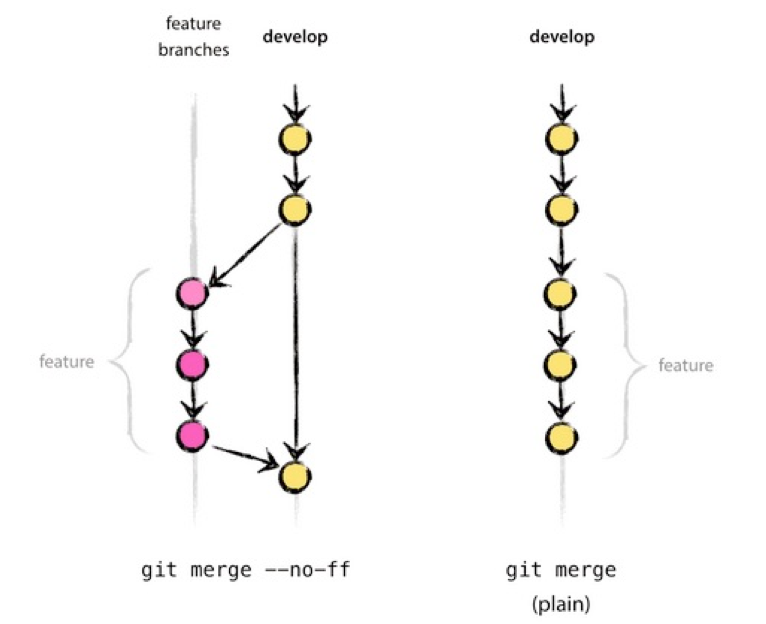

# git介绍以及各种命令操作演示

一、配置名字和邮箱 

```shell
# 安装 Git 之后，你要做的第一件事情就是去配置你的名字和邮箱，因为每一次提交都需要这些信息：

git config --global user.name "ben"
git config --global user.email ben@test.com

# 查看仓库状态
git status

# 查看历史记录
git log
```

二、创建版本库 

```shell
# 什么是版本库呢？版本库又名仓库，英文名repository，你可以简单理解成一个目录，这个目录里面的所有文件都可以被Git管理起来，每个文件的修改、删除，Git都能跟踪，以便任何时刻都可以追踪历史，或者在将来某个时刻可以“还原”。
mkdir testgit && cd testgit
git init

# 瞬间Git就把仓库建好了，可以发现当前目录下多了一个.git的目录，默认是隐藏的，用ls -ah命令就可以看见。
```

三、把文件添加到版本库 

```shell
touch readme.md
git add readme.md

# 然后用命令git commit告诉Git把文件提交到仓库
git commit -m "wrote a readme file"

# 简单解释一下git commit命令，-m后面输入的是本次提交的说明，可以输入任意内容，当然最好是有意义的，这样你就能从历史记录里方便地找到改动记录。一次可以add多个不同的文件，以空格分隔。
git add a.txt b.txt c.txt
```

四、回退到上一个版本或者任意版本 

```shell
# 在 Git中，用HEAD表示当前版本，也就是最新的提交commit id，上一个版本就是HEAD^，上上一个版本就是HEAD^^，当然往上100个版本写100个^比较容易数不过来，所以写成HEAD~100。
# 现在我们要把当前版本回退到上一个版本，就可以使用git reset命令
git reset --hard HEAD^

# 用git log再看看现在版本库的状态，最新的那个版本已经看不到了
# 如果想回到最新的版本，或者指定的版本用如下命令：2e70fdf为commit id
git reset --hard 2e70fdf
# 用来记录你的每一次命令
git reflog
```

五、工作区和暂存区 

```shell
# Git和其他版本控制系统如SVN的一个不同之处就是有暂存区的概念。
# 工作区就是你在电脑里能看到的目录，比如我的testgit文件夹就是一个工作区。
# 工作区有一个隐藏目录.git，这个不算工作区，而是Git的版本库。
# Git的版本库里存了很多东西，其中最重要的就是称为stage（或者叫index）的暂存区，还有Git为我们自动创建的第一个分支master，以及指向 master的一个指针叫HEAD。
# 前面讲了我们把文件往 Git 版本库里添加的时候，是分两步执行的：
# 第一步是用git add把文件添加进去，实际上就是把文件修改添加到暂存区
# 第二步是用git commit提交更改，实际上就是把暂存区的所有内容提交到当前分支。
# 因为我们创建Git版本库时，Git自动为我们创建了唯一一个master分支，所以现在git commit就是往master分支上提交更改。
# 你可以简单理解为，git add命令实际上就是把要提交的所有修改放到暂存区（Stage），然后执行git commit就可以一次性把暂存区的所有修改提交到分支。
# 一旦提交后，如果你又没有对工作区做任何修改，那么工作区就是“干净”的。
```

六、修改与撤销 

```shell
# 查看工作区和版本库里面最新版本的区别。
git diff HEAD -- readme.md

# 丢弃工作区的修改
git checkout -- file

# 命令git checkout -- readme.md意思就是，把readme.md文件在工作区的修改全部撤销，即让这个文件回到最近一次git commit或git add时的状态，当然也可以用git reset命令。
```

七、删除文件 

```shell
# 一般情况下，你通常直接在文件管理器中把没用的文件删了，或者用rm命令删了：
rm readme.md

# 这个时候，Git 知道你删除了文件，因此，工作区和版本库就不一致了，git status命令会立刻告诉你哪些文件被删除了。
# 现在你有两个选择，一是确实要从版本库中删除该文件，那就用命令git rm删掉，并且git commit：git rm readme.md
git commit -m "remove readme.md"

# 现在，文件就从版本库中被删除了。
# 另一种情况是删错了，因为版本库里还有呢，所以可以很轻松地把误删的文件恢复到最新版本：
git checkout -- readme.md
```

八、生成key 

```shell
# 创建 SSH Key。在用户主目录下，看看有没有.ssh目录，如果有，再看看这个目录下有没有id_rsa和id_rsa.pub这两个文件，如果已经有了，可直接跳到下一步。如果没有，打开 Shell（Windows下打开Git Bash），创建SSH Key：
ssh-keygen -t rsa -C "youremail@example.com"

# 你需要把邮件地址换成你自己的邮件地址，然后一路回车，使用默认值即可。如果一切顺利的话，可以在用户主目录里找到.ssh目录，里面有id_rsa和id_rsa.pub两个文件，这两个就是SSH Key的秘钥对，id_rsa是私钥，不能泄露出去，id_rsa.pub是公钥，可以放心地告诉任何人。
# 然后登录GitHub（或者其它Git代码托管平台），打开Account settings，SSH Keys页面，点Add SSH Key，填上任意Title，在Key文本框里粘贴id_rsa.pub文件的内容。
# 为什么GitHub需要SSH Key呢？因为GitHub需要识别出你推送的提交确实是你推送的，而不是别人冒充的，而Git支持SSH协议，所以GitHub只要知道了你的公钥，就可以确认只有你自己才能推送。
# 当然，GitHub允许你添加多个Key。假定你有若干电脑，你一会儿在公司提交，一会儿在家里提交，只要把每台电脑的Key都添加到GitHub，就可以在每台电脑上往GitHub推送了。
```

九、连接远程服务器 

```shell
# Git 最强大的功能之一是可以有一个以上的远程服务器（另一个事实，你总是可以运行一个本地仓库）。你不一定总是需要写访问权限，你可以从多个服务器中读取（用于合并），然后写到另一个服务器中。添加一个远程服务器很简单：
git remote add origin git@github.com:bukas/bukas.git

# 如果你想查看远程服务器的相关信息，你可以这样做
# shows URLs of each remote server
git remote -v

# gives more details about origin
git remote show origin(别名)

# 下一步，就可以把本地库的所有内容推送到远程库上
git push -u origin master

# 把本地库的内容推送到远程，用git push命令，实际上是把当前分支master推送到远程。由于远程库是空的，我们第一次推送master分支时，加上了-u参数，Git不但会把本地的master分支内容推送的远程新的master分支，还会把本地的master分支和远程的master分支关联起来，在以后的推送或者拉取时就可以简化命令。从现在起，只要本地作了提交，就可以通过命令把本地master分支的最新修改推送至GitHub
git push origin master
```

十、克隆代码 

```shell
# 当已经有一个远程库的时候，我们可以用命令git clone克隆一个本地库
git clone git@github.com:test/testgit.git

# 你也许还注意到，GitHub给出的地址不止一个，还可以用https://github.com/test/testgit.git这样的地址。实际上Git支持多种协议，默认的git://使用ssh，但也可以使用 https等其他协议。使用https除了速度慢以外，还有个最大的麻烦是每次推送都必须输入口令，但是在某些只开放http端口的公司内部就无法使用ssh协议而只能用https。
```

十一、创建与合并分支 

```shell
# 首先我们创建dev分支，然后切换到dev分支
git checkout -b dev

# git checkout命令加上-b参数表示创建并切换，相当于以下两条命令
git branch dev
git checkout dev

# 然后用git branch命令查看当前分支
git branch

# 我们在dev分支上进行添加修改操作，然后我们把dev分支的工作成果合并到master分支上
git checkout master
git merge dev

# git merge命令用于合并指定分支到当前分支
# 注意到git merge的信息里面可能有Fast-forward字样，Git告诉我们，这次合并是“快进模式”，也就是直接把master指向dev的当前提交，所以合并速度非常快。当然也不是每次合并都能Fast-forward。合并完成后，就可以放心地删除dev分支了：
git branch -d dev

# 如果要丢弃一个没有被合并过的分支，可以通过git branch -D <branch>强行删除。在本地创建和远程分支对应的分支，使用git checkout -b branch-name origin/branch-name，本地和远程分支的名称最好一致；建立本地分支和远程分支的关联，使用 git branch --set-upstream-to=origin/<branch> mymaster；从远程抓取分支，使用git pull，如果有冲突，要先处理冲突。
```

十二、分支管理策略 



```shell
# 通常，合并分支时，如果可能，Git会用Fast forward模式，但这种模式下，删除分支后，会丢掉分支信息。
# 如果要强制禁用Fast forward模式，Git就会在merge时生成一个新的commit，这样，从分支历史上就可以看出分支信息。
# 下面我们实战一下--no-ff方式的git merge：
# 首先，仍然创建并切换dev分支
git checkout -b dev

# 修改readme.md文件，并提交一个新的commit：
git add readme.md
git commit -m "add merge"

# 现在，我们切换回master：
git checkout master

# 准备合并dev分支，请注意--no-ff参数，表示禁用Fast forward：
git merge --no-ff -m "merge with no-ff" dev

# 保存你之前的分支历史。能够更好的查看 merge历史，以及branch 状态。
git merge –no-ff

# 不会显示 feature，只保留单条分支记录
git merge
```

 十三、标签管理 

```shell
# 发布一个版本时，我们通常先在版本库中打一个标签，这样，就唯一确定了打标签时刻的版本。将来无论什么时候，取某个标签的版本，就是把那个打标签的时刻的历史版本取出来。所以，标签也是版本库的一个快照。
# 命令git tag <tagname>用于新建一个标签，默认为HEAD，也可以指定一个commit id。git tag -a <tagname> -m "blablabla..."可以指定标签信息。
# 还可以通过-s用私钥签名一个标签
git tag -s v0.5 -m "signed version 0.2 released" fec145a

# 查看所有标签
git tag

# 用命令git show <tagname>可以查看某个标签的详细信息。
# 如果标签打错了，也可以删除
git tag -d v0.1

# 因为创建的标签都只存储在本地，不会自动推送到远程。所以，打错的标签可以在本地安全删除。如果要推送某个标签到远程，使用命令git push origin <tagname>：
git push origin v1.0

# 或者，一次性推送全部尚未推送到远程的本地标签
git push origin --tags

# 如果标签已经推送到远程，要删除远程标签就麻烦一点，先从本地删除：
git tag -d v0.9

# 然后，从远程删除。删除命令也是push，但是格式如下
git push origin :refs/tags/v0.9
```

十四、忽略特殊文件 

```shell
# 有些时候，你必须把某些文件放到Git工作目录中，但又不能提交它们，比如保存了数据库密码的配置文件啦，等等，每次git status都会显示Untracked files…，有强迫症的童鞋心里肯定不爽。好在Git考虑到了大家的感受，这个问题解决起来也很简单，在 Git工作区的根目录下创建一个特殊的.gitignore文件，然后把要忽略的文件名填进去，Git就会自动忽略这些文件。不需要从头写.gitignore文件，GitHub已经为我们准备了各种配置文件，只需要组合一下就可以使用了。所有配置文件可以直接在线浏览：https://github.com/github/gitignore
```


