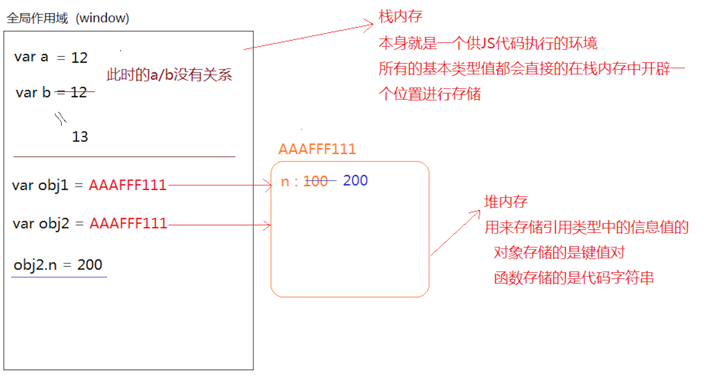

# 一、前端发展史

### 第一阶段

C/S（Client server） -> B/S（Browser server）

##### 网页制作

技术栈：PhotoShop、Html、Css


### 第二阶段

从静态到动态、从后端到前端	前端工程师

前后端分离

后台：完成数据的分析和业务逻辑编写（包含Api接口编写）

前端：网页制作、Js交互效果、数据的交互和绑定

技术栈：Javascript、Ajax（跨域技巧），Jquery


### 第三阶段

从前端到全端（从PC端到移动端）

技术栈：H5、Css3、响应式布局开发、Zepto、Hybird（混合App开发）、微信小程序


### 第四阶段

从全端到全栈

全栈开发：前后端都可以开发（严格意义讲，一种语言完成前后端开发）

技术栈：NODE（基于Js编程语言开发服务器端程序），express、koa


# 二、关于浏览器的内核和引擎

webkit（V8引擎）：大部分浏览器

gecko：火狐

trident：IE


W3C：万维网联盟，制定编程语言的规范与标准

开发者按照规范编写代码，浏览器开发商也会开发一套按照规范把代码渲染成页面的东西（这个东西就是内核或者引擎）

浏览器内核作用：按照一定的规范，把代码基于GPU（显卡）绘制出对应的图形和页面等


浏览器兼容：

1.部分浏览器会提前开发一些更好的功能，后期这些功能会被收录到W3C规范中，但是在收录之前，会存在一定的兼容性

2.各个浏览器厂商，为了突出自己的独特性，用其他方法实现了W3C规范中的功能


# 三、Javascript

JS：轻量级的客户端脚本编程语言

1.编程语言

HTML+CSS是标记语言

编程语言是具备一定逻辑的，拥有自己的编程思想（面向对象编程【oop】、面向过程编程）

2.目前的JS已经不仅仅是客户端语言了，基于node可以做服务器端程序，所以js是全栈编程语言

3.组成部分

- ECMASCRIPT（ES）：JS的核心语法
- DOM：Document Object Model 文档对象模型
- BOM：Browser Object Model 浏览器对象模型


# 四、ESMAScript

它是JS的语法规划，JS中的变量、数据类型、语法规范、操作语句、设计模式等等都是ES规定的


# 五、变量（variable）

它不是具体的值，只是一个用来存储具体值的容器或者代名词，因为它存储的值可以改变，所以称为变量基于ES语法规范，在JS中创建变量有以下方式

- var (ES3)

- function (ES3) 创建函数(函数名也是变量，只不过存储的值是函数类型的而已)

- let (ES6)

- const (ES6) 创建的是常量

- import (ES6) 基于ES6的模块规范导出需要的信息

- class (ES6) 基于ES6创建类

```js
/*
 * 语法：
 *   var [变量名]=值
 *   let [变量名]=值
 *   const [变量名]=值
 *   function 函数名(){
 *
 *   }
 *   ...
 */
var n = 13;
n = 15;
alert(n+10);//=>弹出来25 此时的N代表15

const m = 100;
m = 200;//=>Uncaught TypeError: Assignment to constant variable. 不能给一个常量重新的赋值（常量存储的值不能被修改，能够修改就是变量了）
```

创建变量，命名的时候要遵循一些规范

- 严格区分大小写

- 遵循驼峰命名法：按照数字、字母、下划线或者$来命名（数字不能做为名字的开头），命名的时候基于英文单词拼接成一个完整的名字（第一个单词字母小写，其余每一个有意义单词的首字母都大写）

- 不能使用关键字和保留字：在JS中有特殊含义的叫做关键词，未来可能会成为关键字的叫做保留字

```js
var n=12;
var N=13; //=>两个n不是同一个变量

var studentInfo / student_info / _studentInfo（下划线在前的，都是公共变量） / $studentInfo（一般存储的是JQ元素）...

语义化强一些
add / create / insert
del（delete）/ update / remove（rm）
info / detail
log
...
```


# 六、数据类型

- 基本数据类型（值类型）
  - 数字number

  - 字符串string
  - 布尔boolean
  - null
  - undefined

- 引用数据类型
  - 对象object
    - 普通对象
    - 数组对象
    - 正则对象
    - 日期对象
    - ...
  - 函数function

- ES6中新增加的一个特殊的类型：Symbol，唯一的值

```js
[基本数据类型]
var n = 13; //=>0 -13 13.2 数字类型中有一个特殊的值NaN（not a number代表不是一个有效的数字,但是属于number类型的）

var s = '';//=>"" '13' "{}" JS中所有用单引号或者双引号包裹起来的都是字符串，里面的内容是当前字符串中的字符（一个字符串由零到多个字符组成）

var b = true;//=>布尔类型只有两个值 true真 false假

[引用数据类型]
var o = {name:'ben',age:9};//=>普通的对象：由大括号包裹起来，里面包含多组属性名和属性值（包含多组键值对） {}空对象

var ary = [12,23,34,45]; //=>中括号包裹起来，包含零到多项内容，这种是数组对象  []空数组

var reg = /-?(\d|([1-9]\d+))(\.\d+)?/g; //=>由元字符组成一个完整的正则  //不是空正则是单行注释

function fn(){

}

[Symbol]
创建出来的是一个唯一的值
var a = Symbol('ben');
var b = Symbol('ben');
a==b =>false
```


# 七、JS代码如何被运行以及运行后如何输出结果

[如何被运行]

- 把代码运行在浏览器中(浏览器内核来渲染解析)

- 基于NODE来运行(NODE也是一个基于V8引擎渲染和解析JS的工具)

[如何输出结果]

- alert：在浏览器中通过弹框的方式输出(浏览器提示框)

```js
var num=12;
alert(num); //=>window.alert

var str='ben';
alert(str);

基于alert输出的结果都会转换为字符串：把值(如果是表达式先计算出结果)通过toString这个方法转换为字符串，然后再输出
alert(1+1); =>'2'
alert(true); =>'true'
alert([12,23]); =>'12,23'
alert({name:'xxx'}); =>'[object Object]' // 对象toString后的结果就是object object，为啥？
```

- confirm：和alert的用法一致，只不过提示的框中有确定和取消两个按钮，所以它是确认提示框

```js
var flag = confirm('确定要退出吗?');
if(flag){
   //=>flag:true 用户点击的是确定按钮
}else{
   //=>flag:false 用户点击的是取消按钮
}
```

- prompt：在confirm的基础上增加输入框
- console.log：在浏览器控制台输出日志（按F12(FN+F12)打开浏览器的控制台）
  - Elements：当前页面中的元素和样式在这里都可以看到，还可以调节样式修改结构等
  - Console：控制台，可以在JS代码中通过.log输出到这里，也可以在这里直接的编写JS代码
  - Sources：当前网站的源文件都在这里
  - ...

- console.dir：比log输出的更加详细一些（尤其是输出对象数据值的时候）
- console.table：把一个JSON数据按照表格的方式输出
- ... （自己回去扩展更多console输出方法）


# 八、数据类型的详细剖析

##### 1. number数字类型

NaN：not a number 但是它是数字类型的

isNaN：检测当前值是否不是有效数字，返回true代表不是有效数字，返回false是有效数字

```js
//=>语法：isNaN([value])
var num=12;
isNaN(num); //->检测num变量存储的值是否为非有效数字 false

isNaN('13') =>false
isNaN('Ben') =>true
isNaN(new String("222222")) =>false
isNaN(new String("222222a")) =>true
isNaN(true) =>false
isNaN(false) =>false
isNaN(null) =>false
isNaN(undefined) =>true
isNaN({age:9}) =>true
isNaN([12,23]) =>true
isNaN([12]) =>false
isNaN(/^$/) =>true
isNaN(function(){}) =>true

重要：isNaN检测的机制
1、首先验证当前要检测的值是否为数字类型的，如果不是，浏览器会默认的把值转换为数字类型

  把非数字类型的值转换为数字
  - 其它基本类型转换为数字：直接使用Number这个方法转换的

  [字符串转数字]
    Number('13') ->13
    Number('13px') ->NaN 如果当前字符串中出现任意一个非有效数字字符，结果则为NaN
    Number('13.5') ->13.5 可以识别小数

  [布尔转数字]
    Number(true) ->1
    Number(false) ->0

  [其它]
    Number(null) ->0
    Number(undefined) ->NaN

  - 把引用数据类型值转换为数字：先把引用值调取toString转换为字符串，然后再把字符串调取Number转换为数字

   [对象]
     ({}).toString() ->'[object Object]' ->NaN

   [数组]
     [12,23].toString() ->'12,23' ->NaN
     [12].toString() ->'12' ->12

   [正则]
     /^$/.toString() ->'/^$/' ->NaN

  Number('') ->0
  [].toString() ->''
  => isNaN([])：false

2、当前检测的值已经是数字类型，是有效数字返回false，不是返回true（数字类型中只有NaN不是有效数字，其余都是有效数字）

```

##### 2. parseInt / parseFloat

- 等同于Number，也是为了把其它类型的值转换为数字类型

- 和Number的区别在于字符串转换分析上

- Number：出现任意非有效数字字符，结果就是NaN

- parseInt：把一个字符串中的整数部分解析出来，parseFloat是把一个字符串中小数(浮点数)部分解析出来

```js
parseInt('13.5px') =>13
parseFloat('13.5px') =>13.5

parseInt('width:13.5px') =>NaN // 从字符串最左边字符开始查找有效数字字符，并且转换为数字，但是一但遇到一个非有效数字字符，查找结束
```

##### 3. NaN的比较

```js
NaN==NaN：// false NaN和谁都不相等，包括自己
```

##### 4.思考题：有一个变量num，存储的值不知道，我想检测它是否为一个有效数字，下面方案是否可以

```js
if(Number(num)==NaN){
    alert('num不是有效数字!');
}

// NaN和谁都不相等，条件永远不成立（即使num确实不是有效数字，转换的结果确实是NaN，但是NaN!=NaN的）

if(isNaN(num)){
    //=>检测是否为有效数字，只有这一种方案
    alert('num不是有效数字!')
}
```


# 九、布尔类型

> 只有两个值：true / false 

如何把其它数据类型转换为布尔类型?
- Boolean
- !
- !!

```javascript
Boolean(1) =>true

!'Ben' =>先把其它数据类型转换为布尔类型，然后取反

!!null =>去两次反，等价于没取反，也就剩下转换为布尔类型了
```

规律：**`在JS中只有“0/NaN/空字符串/null/undefined”这五个值转换为布尔类型的false，其余都转换为true`**

----

# 十、 null && undefined
> 都代表空或者没有
> - null：空对象指针
> - undefined：未定义

null一般都是意料之中的没有（通俗理解：一般都是人为手动的先赋值为null，后面的程序中我们会再次给他赋值）
```javascript
var num = null; //=>null是手动赋值，预示着后面我会把num变量的值进行修改
...
num = 12;
```

undefined代表的没有一般都不是人为手动控制的，大部分都是浏览器自主为空（后面可以赋值也可以不赋值）
```javascript
var num; //=>此时变量的值浏览器给分配的就是undefined
...
后面可以赋值也可以不赋值
```

Ken（BOY）的女朋友是null，他的男朋友是undefined

----

# 十一、object对象数据类型
> 普通对象
> - 由大括号包裹起来的
> - 由零到多组属性名和属性值（键值对）组成

`属性是用来描述当前对象特征的，属性名是当前具备这个特征，属性值是对这个特征的描述（专业语法，属性名称为键[key]，属性值称为值[value]，一组属性名和属性值称为一组键值对）`
```javascript
var obj = {
	name:'Ben',
	age:9
};
//=>对象的操作：对键值对的增删改查
语法：对象.属性 / 对象[属性]

[获取]
obj.name 
obj['name']  一般来说，对象的属性名都是字符串格式的（属性值不固定，任何格式都可以）

[增/改]
JS对象中属性名是不允许重复的，是唯一的
obj.name='Ben'; //=>原有对象中存在NAME属性，此处属于修改属性值
obj.sex='男'; //=>原有对象中不存在SEX，此处相当于给当前对象新增加一个属性SEX
obj['age']=28;

[删]
彻底删除：对象中不存在这个属性了
delete obj['age'];

假删除：并没有移除这个属性，只是让当前属性的值为空
obj.sex=null;

----
在获取属性值的时候，如果当前对象有这个属性名，则可以正常获取到值（哪怕是null），但是如果没有这个属性名，则获取的结果是undefined
obj['friends'] =>undefined
```

思考题：
```javascript
var obj = {
	name:'Ben',
	age:9
};
var name = 'zhufeng';

obj.name  =>'Ben'  获取的是NAME属性的值
obj['name'] =>'Ben' 获取的是NAME属性的值
obj[name] =>此处的NAME是一个变量,我们要获取的属性名不叫做NAME，是NAME存储的值'zhufeng' =>obj['zhufeng'] =>没有这个属性,属性值是undefined

----
'name' 和 name 的区别?
  => 'name'是一个字符串值，它代表的是本身
  => name是一个变量，它代表的是本身存储的这个值
```

一个对象中的属性名不仅仅是字符串格式的，还有可能是数字格式的
```
var obj = {
	name:'Ben',
	0:100
};
obj[0] =>100
obj['0'] =>100
obj.0 =>Uncaught SyntaxError: Unexpected number

----
当我们存储的属性名不是字符串也不是数字的时候，浏览器会把这个值转换为字符串（toString），然后再进行存储

obj[{}]=300;  =>先把({}).toString()后的结果作为对象的属性名存储进来 obj['[object Object]']=300

obj[{}] =>获取的时候也是先把对象转换为字符串'[object Object]',然后获取之前存储的300

----
数组对象（对象由键值对组成的）
var oo = {
	a:12
};
var ary = [12,23]; //=>12和23都是属性值，属性名呢？

通过观察结果，我们发现数组对象的属性名是数字（我们把数字属性名称为当前对象的索引）
ary[0]
ary['0']
ary.0  =>报错
```

-----

# 十二、JS中的判断操作语句
1、if / else if / else
```javascript
var num = -6;
if(num>10){
	num++; //=>num=num+1 num+=1 在自身的基础上累加1
}else if(num>=0 && num<=10){
	num--;
}else{
	num+=2;
}
console.log(num);
```

只要有一个条件成立，后面不管是否还有成立的条件，都不在判断执行了
```javascript
var num = 10;
if(num>5){
	num+=2;
}else if(num>8){
	num+=3;
}else{
	num+=4;
}
console.log(num); //=>12
```

关于条件可以怎么写？
```javascript
// >= / <= / == 常规比较
if(0){
	//=>不管你在条件判断中写什么，最后总要把其计算出TRUE/FALSE来判断条件是否成立（把其它类型的值转换为布尔类型，只有 0/NaN/''/null/undefined 是false，其余都是true）
}

if('3px'+3){
	//=>在JS中，+ - * / % 都是数学运算，除 + 以外，其余运算符在运算的时候，如果遇到了非数字类型的值，首先会转换为数字类型（Number），然后再进行运算
	
	//=>+ 在JS中除了数学相加，还有字符串拼接的作用（如果运算中遇到了字符串，则为字符串拼接，而不是数学相加）

	'3px'+3 =>'3px3'
}
if('3px'-3){
	'3px'-3 =>NaN
}
```

BAT面试题：
```javascript
var num = parseInt('width:35.5px');
if(num==35.5){
	alert(0);
}else if(num==35){
	alert(1);
}else if(num==NaN){
	alert(2);
}else if(typeof num=='number'){
    //=>先算typeof num
    //=>在做比较
	alert(3);//=>alert输出的都是字符串格式的 '3'
}else{
    alert(4);
}
```

# 十三、typeof
> 在JS中用来检测数据类型的方式之一，除了它以外，还有：
> - instanceof
> - constructor
> - Object.prototype.toString.call()

```javascript
语法：typeof [value] =>检测value的数据类型

返回值：使用typeof检测出来的结果是一个字符串，字符串中包含着对应的数据类型，例如："number"/"string"/"boolen"/"undefined"/"object"/"function"
 
typeof null =>"object" 因为null代表空对象指针（没有指向任何的内存空间）

typeof检测数组/正则/对象，最后返回的都是"object"，也就是基于这种方式无法细分对象

面试题：
console.log(typeof []); 
//=>"object"

console.log(typeof typeof []); 
//=>typeof "object"
//=>"string"
```


2、三元运算符
> 语法：条件?成立做的事情:不成立做的事情;  <=>相当于简单的if/else判断

```javascript
var num=12;
if(num>10){
    num++;
}else{
	num--;
}
//=>改写成三元运算符
num>10?num++:num--;
```

特殊情况
```javascript
//=>如果三元运算符中的某一部分不需要做任何的处理，我们用 null/undeifned/void 0... 占位即可
var num = 12;
num>10?num++:null;

//=>如果需要执行多项操作，我们把其用小括号包裹起来，每条操作语句用逗号分隔
num=10;
num>=10?(num++,num*=10):null;
```

思考题
```javascript
var num = 12;
if(num>0){
	if(num<10){
		num++;
	}else{
		num--;
	}
}else{
	if(num==0){
		num++;
		num=num/10;
	}
}
改写成三元运算符！
```

3、switch case
> JS中的一种判断方式
```javascript
var num = 12;
if(num==10){
	num++;
}else if(num==5){
	num--;
}else{
	num=0;
}

//=>改成switch case
switch(num){
	case 10:
		num++;
		break;
	case 5:
		num--;
		break;
	default:
		num=0;	
}

//=>switch case 应用于变量（或者表达式等）在不同值情况下的不同操作，每一种case结束后都要加break（结束整个判断）
```

switch case中每一种case情况的比较都是基于"==="绝对相等来完成的
```javascript
'10'==10 
=>true 相等比较,如果等号左右两边的类型不一样，首先会转换为一样的数据类型，然后再进行比较
=>当前案例中，就是把字符串'10'转换为数字了，然后再比较的

'10'===10 绝对比较，如果两边的数据类型不一样，则直接不相等，它要求类型和值都完全一样才会相等（真实项目中为了保证代码的严谨性，我们应该更多使用绝对比较）
```


# 十四、JS运行机制



# 十五、FOR循环
> 作用：按照一定的规律，重复去做某件事情，此时我们就需要使用循环来处理了

# 十六、 获取页面中的DOM元素
`document.getElementById`
> 在整个文档中，同过元素的ID属性值，获取到这个元素对象
> 
> getElementById是获取元素的方法，而document限定了获取元素的范围，我们把这个范围称之为：“上下文 [context]”

```javascript
var oBox = document.getElementById('box');

1. 同过getElementById获取的元素是一个对象数据类型的值（里面包含很多内置的属性）
typeof oBox  =>"object"

2. 分析包含的属性
className：存储的是一个字符串，代表当前元素的样式类名
id：存储的是当前元素ID值（字符串）

innerHTML：存储当前元素中所有的内容（包含HTML标签）
innerText：存储当前元素中所有的文本内容（没有元素标签）

onclick：元素的一个事件属性，基于这个属性，可以给当前元素绑定点击事件
onmouseover：鼠标滑过事件
onmouseout：鼠标离开事件

style：存储当前元素所有的 "行内样式" 值（获取和操作的都只能是写在标签上的行内样式，写在样式表中的样式，无法基于这个属性获取到）

...
```

`[context].getElementsByTagName`
> 在指定的上下文中，通过元素的标签名获取一组元素集合
> 
> 上下文是我们自己来指定的

```javascript
var boxList = oBox.getElementsByTagName('li');

1. 获取的结果是一个元素集合（HTMLCollection）,首先它也是对象数据类型的，结构和数组非常相似（数字作为索引，length代表长度），但是不是数组，我们把它叫做“类数组”

boxList[0] 获取当前集合中的第一个LI（通过索引获取到具体的某一个LI即可）
boxList.length 获取集合中LI的数量

2. 集合中的每一项存储的值又是一个元素对象（对象数据类型，包含很多的内置属性，例如：id/className...）

boxList[1].style.color='red';  修改集合中第二个LI的文字颜色
```

# 十七、函数
> 在JS中，函数就是一个方法（一个功能体），基于函数一般都是为了实现某个功能

```javascript
var total=10;
total+=10;
total=total/2;
total=total.toFixed(2);//=>保留小数点后边两位（数字由一个方法toFixed用来保留小数点后面的位数）

....

在后续的代码中，我们依然想实现相同的操作（加10除以2），我们需要重新编写代码
var total=10;
total+=10;
total=total/2;
total=total.toFixed(2);

...

这样的方式会导致页面中存在大量冗余的代码，也降低了开发的效率，如果我们能把实现这个功能的代码进行“封装”，后期需要这个功能执行即可，这样就好了！
```
**`函数诞生的目的就是为了实现封装`**：把实现一个功能的代码封装到一个函数中，后期想要实现这个功能，只需要把函数执行即可，不必要再次编写重复的代码，起到了**`低耦合高内聚（减少页面中的冗余代码，提高代码的重复使用率）`**的作用

```javascript
function fn(){
	var total=10;
	total+=10;
	total/=2;
	total=total.toFixed(2);
	console.log(total);
}
fn();
fn();
...
想用多少次，我们就执行多少次函数即可

=====
ES3标准中：
//=>创建函数
function 函数名([参数]){
	函数体：实现功能的JS代码
}
//=>函数执行
函数名(); 

=====
ES6标准中创建箭头函数：
let 函数名(变量名)=([参数])=>{
	函数体
}
函数名();

let fn=()=>{
	let total=10;
	...
};
fn();
```

函数作为引用数据类型中的一种，它也是按照引用地址来操作的，接下来我们学习一下函数的运行机制
```javascript
function fn(){
	var total=10;
	total+=10;
	total=total.toFixed(2);
	console.log(total);
}
fn();

【创建函数】
1. 函数也是引用类型，首先会开辟一个新的堆内存，把函数体中的代码当做“字符串”存储到内存中（对象向内存中存储的是键值对）
2. 把开辟的堆内存地址赋值给函数名(变量名)

此时我们输出fn（切记不是fn()）代表当前函数本身
如果我们执行fn()，这是把函数执行
所以是否加小括号是两种不同本质的操作

【函数执行】
目的：把之前存储到堆内存中的代码字符串变为真正的JS代码自上而下执行，从而实现应有的功能

1.函数执行，首先会形成一个私有的作用域（一个供代码执行的环境，也是一个栈内存）
2.把之前在堆内存中存储的字符串复制一份过来，变为真正的JS代码，在新开辟的作用域中自上而下执行 
```

# 十八、函数中的参数
> 参数是函数的入口：当我们在函数中封装一个功能，发现一些原材料不确定，需要执行函数的时候用户传递进来才可以，此时我们就基于参数的机制，提供出入口即可

```javascript
//=>此处的参数叫做形参：入口，形参是变量（n/m就是变量）
function sum(n,m){
	//=>n和m分别对应要求和的两个数字
	var total = 0;
	total = n + m;
	console.log(total);
}

//=>此处函数执行传递的值是实参：实参是具体的数据值
sum(10,20);  //=>n=10 m=20
sum(10); //=>n=10 m=undefined
sum(); //=>n和m都是undefined
sum(10,20,30); //=>n=10 m=20  30没有形参变量接收
```


